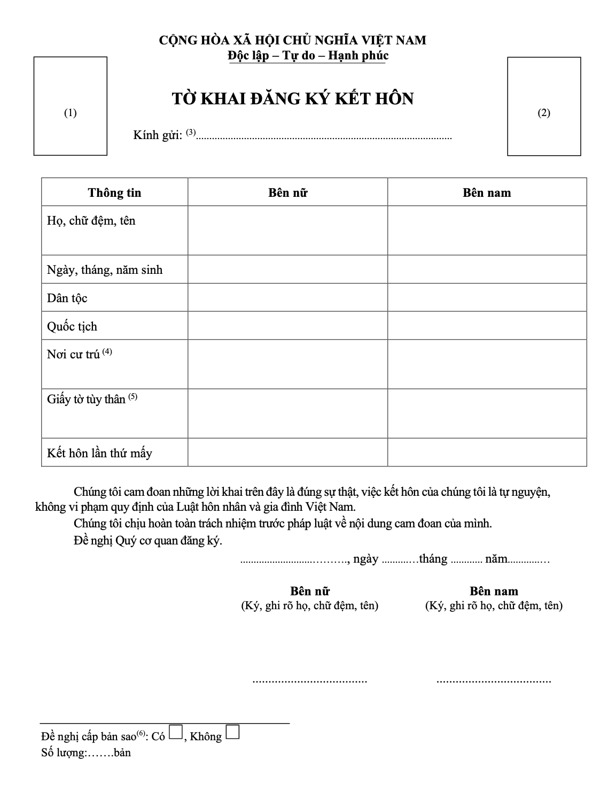
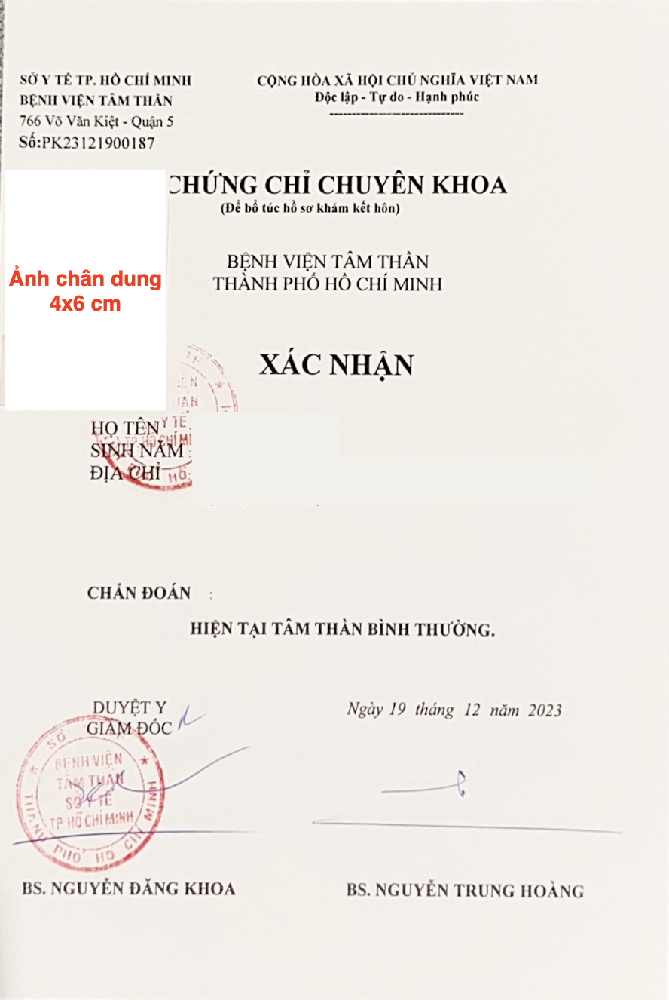

**Xin chào, mình là Hương!** Gia đình mình là vợ Việt chồng Đức, tụi mình đã kết hôn được hơn một năm và hiện đang sinh sống tại Việt Nam.

Tụi mình đã đăng ký kết hôn từ năm 2024 qua hình thức nộp trực tiếp (bạn cũng có thể nộp trực tuyến hoặc sử dụng dịch vụ bưu chính). Trong bài viết này mình sẽ chia sẻ chi tiết về trải nghiệm khi chuẩn bị **hồ sơ đăng ký kết hôn với người nước ngoài (NNN) tại Việt Nam**, bao gồm: thủ tục, giấy tờ cần thiết, lệ phí và những lưu ý quan trọng.

Mình hy vọng bài viết này sẽ giúp bạn dễ dàng hơn trên hành trình hoàn thiện thủ tục quan trọng này!

## I. Quy Trình Đăng Ký Kết Hôn Với Người Nước Ngoài Tại Việt Nam
### Bước 1: Chuẩn Bị Hồ Sơ
Cả hai bên nam và nữ cần chuẩn bị đầy đủ các giấy tờ được liệt kê chi tiết ở **Mục III** phía dưới.
### Bước 2: Nộp Hồ Sơ Đăng Ký Kết Hôn
**Nơi nộp hồ sơ:** Hồ sơ được trực tiếp nộp tại **UBND cấp xã** có thẩm quyền nơi **người Việt Nam thường trú hoặc tạm trú dài hạn**. Nhà mình sinh sống và có đăng ký tạm trú 1 năm ở quận Bình Thạnh, TP. HCM nên đã thực hiện nộp hồ sơ tại UBND quận Bình Thạnh.

Sau đó, cán bộ tiếp nhận hồ sơ sẽ đối chiếu thông tin trong Tờ khai và kiểm tra tính chính xác, hợp lệ, đầy đủ và thống nhất của giấy tờ trong hồ sơ do người yêu cầu nộp, xuất trình.
- Nếu hồ sơ **đầy đủ và hợp lệ**, cán bộ tiếp nhận sẽ gửi Phiếu hẹn trả kết quả.
- Nếu hồ sơ chưa hoàn thiện thì cán bộ tiếp nhận sẽ hướng dẫn ngay để người nộp lịp thời bổ sung, hoàn thiện theo quy định.
### Bước 3: Nhận Kết Quả
1. Thời gian chờ xử lý hồ sơ: 10 ngày làm việc kể từ khi hồ sơ đầy đủ được tiếp nhận.
2. Khi nhận kết quả, bắt buộc yêu cầu cả bên nam và nữ đồng thời có mặt, mang theo giấy tờ tuỳ thân để đối chiếu (người Việt Nam: CCCD hoặc hộ chiếu, loại giấy tờ nào được ghi trong Tờ khai đăng ký kết hôn; người nước ngoài: hộ chiếu). 
3. Người nộp đơn sẽ thực hiện đóng lệ phí trước khi ký Giấy chứng nhận kết hôn. 
4. Hai bạn sẽ kiểm tra tính xác thực và đầy đủ của thông tin trên Giấy chứng nhận kết hôn và Sổ đăng ký kết hôn và thực hiện ký tên. Sau khi hoàn thành, mỗi bên sẽ nhận được 1 bản chính Giấy chứng nhận kết hôn.

> ⚠️ Nếu một trong hai bên nam, nữ không thể có mặt để nhận Giấy chứng nhận kết hôn thì Phòng Tư pháp sẽ hỗ trợ **gia hạn** thời gian trao Giấy chứng nhận kết hôn nhưng **không quá 60 ngày** kể từ ngày hẹn nhận kết quả ban đầu theo Phiếu hẹn trước đó. Quá 60 ngày mà hai bên không đến nhận Giấy chứng nhận kết hôn thì Giấy chứng nhận kết hôn lần này sẽ **bị huỷ bỏ** và nếu hai bạn vẫn muốn đăng ký kết hôn thì sẽ phải **thực hiện quy trình này lại từ đầu**.

## II. Lệ Phí Đăng Ký Kết Hôn Với Người Nước Ngoài Tại Việt Nam
Mức lệ phí cụ thể do Hội đồng nhân dân tỉnh, thành phố trực thuộc Trung Ương quyết định. Như vậy, mức lệ phí đăng ký kết hôn người nước ngoài tại Việt Nam ở mỗi địa phương có thể khác nhau, không thống nhất. Thông thường, mức lệ phí này dao động trong khoảng **1.000.000 VNĐ đến 1.500.000 VNĐ**. Bạn nên hỏi kỹ cán bộ tiếp nhận hồ sơ để biết mức phí chính xác tại nơi mình nộp.

| STT | Tỉnh/Thành phố | Lệ phí đăng ký kết hôn |
|:--:|:----------------|:------------------------:|
| 1 | Hà Nội | 1.000.000 VNĐ |
| 2 | TP. HCM | 1.000.000 VNĐ (mức mình đã đóng) |
| 3 | Đà Nẵng | 1.500.000 VNĐ |
| 4 | Nam Định | 900.000 VNĐ |
| 5 | Nghệ An | 1.200.000 VNĐ |

## III. Thành Phần Hồ Sơ Đăng Ký Kết Hôn Với Người Nước Ngoài Tại Việt Nam
### 1. Giấy Tờ Phải Xuất Trình (Để Đối Chiếu Thông Tin)

| STT | Người chuẩn bị     | Tên giấy tờ                                           | Số lượng   | Yêu cầu                                                                                                                                   |
|-----|---------------------|--------------------------------------------------------|------------|-------------------------------------------------------------------------------------------------------------------------------------------|
| 1   | Người Việt Nam       | Hộ chiếu/CCCD                                         | 1 bản gốc  |                                                                                                                                           |
| 2   | Người nước ngoài     | Hộ chiếu                                              | 1 bản gốc  |                                                                                                                                           |
| 3   | Người nước ngoài     | Giấy chứng minh tình trạng hôn nhân của NNN          | 1 bản gốc  | Do cơ quan có thẩm quyền của nước mà NNN là công dân cấp, chưa quá 6 tháng tính đến ngày nhận hồ sơ.                                     |
| 4   | Người nước ngoài     | Giấy xác nhận cư trú của NNN tại Việt Nam            | 1 bản gốc  | Do công an xã/phường cấp.                                                                                                                 |
| 5   | Người Việt Nam       | Giấy xác nhận độc thân của công dân Việt Nam         | 1 bản gốc  | Do UBND cấp xã cấp, chưa quá 6 tháng tính đến ngày nhận hồ sơ.                                                                           |
| 6   | Người Việt Nam       | Giấy xác nhận cư trú của người Việt Nam              | 1 bản gốc  | Do công an xã/phường cấp.                                                                                                                 |
### 2. Giấy Tờ Phải Nộp

| STT | Người chuẩn bị                  | Tên giấy tờ                                                       | Số lượng         | Yêu cầu                                                                                   |
|-----|---------------------------------|--------------------------------------------------------------------|------------------|-------------------------------------------------------------------------------------------|
| 1   | Người Việt Nam và người nước ngoài | Tờ khai đăng ký kết hôn                                            | 1 bản gốc        | - Hai bên nam nữ có thể khai chung vào 1 tờ khai (nếu nộp hồ sơ theo hình thức trực tiếp)    - Mẫu tờ khai [ở đây](https://cdn.thuvienphapluat.vn/uploads/tintuc/2022/11/16/to-khai-dang-ky-ket-hon-moi-nhat.docx) |
| 2   | Người Việt Nam và người nước ngoài | Giấy khám sức khoẻ tâm thần để đăng ký kết hôn (mình sẽ hướng dẫn cụ thể quy trình này ở Mục IV bên dưới) | 1 bản gốc/người  | Do tổ chức y tế có thẩm quyền ở Việt Nam cấp, chưa quá 6 tháng tính đến ngày nhận hồ sơ |
| 3   | Người Việt Nam và người nước ngoài | Ảnh chân dung 3x4 cm                                               | 1 ảnh/người      |                                                                                           |
| 4   | Người nước ngoài                | Giấy chứng minh tình trạng hôn nhân của NNN                        | 1 bản hợp pháp hóa lãnh sự | Bản hợp pháp hóa lãnh sự phải được dịch thuật sang tiếng Việt và công chứng             |
| 5   | Người nước ngoài                | Bản sao hộ chiếu/giấy tờ có giá trị thay thế hộ chiếu              | 1 bản sao y công chứng |                                                                                           |
| 6   | Người nước ngoài                | Giấy xác nhận cư trú của NNN tại Việt Nam                          | 1 bản sao         |          (nếu đăng ký kết hôn tại nơi tạm trú) |                                                                                 |
| 7   | Người Việt Nam                 | Giấy xác nhận độc thân của công dân Việt Nam                       | 1 bản sao         |                                                                                           |
| 8   | Người Việt Nam                 | Giấy xác nhận cư trú của người Việt Nam                            | 1 bản sao         |                                                                                           |

## IV. Hướng Dẫn Chi Tiết Chuẩn Bị Hồ Sơ
### 1. Cách Điền Tờ Khai Đăng Ký Kết Hôn

Bạn nên lưu ý:

- (1) - Dán ảnh 3x4 cm của bên nữ.

- (2) - Dán ảnh 3x4 cm của bên nam.

- (3) - Ghi rõ tên cơ quan đăng ký kết hôn (Ví dụ: UBND quận Bình Thạnh).

- Dân tộc - Ghi theo giấy khai sinh của mỗi bên (Ví dụ: bên nữ dân tộc Kinh thì ghi “Kinh”, bên nam là người nước ngoài không có thông tin thì để trắng).

- (4) - Người Việt Nam: Ghi theo nơi thường trú, nếu không có địa chỉ thường trú thì ghi địa chỉ tạm trú. Người nước ngoài: Ghi địa chỉ tạm trú tại Việt Nam.

- (5) - Người Việt Nam: Ghi số định danh cá nhân/CCCD/thẻ căn cước/hộ chiếu (ví dụ: Thẻ căn cước công dân số …, Cục CS QLHC về trật tự xã hội cấp ngày …). Người nước ngoài: ghi số hộ chiếu, quốc gia cấp hộ chiếu và ngày cấp (ví dụ: Hộ chiếu số …, Cộng hoà Liên bang Đức cấp ngày …).

- (6) - Nếu bạn có yêu cầu cấp bản sao thì đánh dấu X và ghi rõ số lượng.

### 2. Giấy Khám Sức Khoẻ Để Đăng Ký Kết Hôn Với Người Nước Ngoài

#### 2.1. Địa điểm khám:

**a. Thành phố Hồ Chí Minh:**
- Nhà mình ở TP. HCM nên đã đi khám tại Bệnh Viện Tâm Thần Thành Phố Hồ Chí Minh, số 766 Võ Văn kiệt, Phường 1, Quận 5, TP. HCM. Chi phí: 600.000 VNĐ/người (kết quả lấy luôn trong ngày), 400.000 VNĐ/người (kết quả có trong 2-3 ngày).
- Ngoài ra, bạn có thể tới: 
Bệnh Viện Chợ Rẫy, số 201B Nguyễn Chí Thanh, Phường 12, Quận 5, TP. HCM. Hoặc:
Trung Tâm Pháp Y Tâm Thần khu vực TP. HCM, số 152-154 Hồng Bàng, Phường 2, Quận 5, TP. HCM. Chi phí: 600.000 VNĐ cho 2 người.

**b. Hà Nội:**
- Bệnh Viện Bạch Mai, số 78 Đ. Giải Phóng, Phương Đình, Đống Đa, Hà Nội.
- Bệnh Viện Việt Pháp, số 1 Phương Mai, Đống Đa, Hà Nội.
- Trung Tâm Pháp Y Hà Nội, địa chỉ tại Chung cư B6A, P. Nguyễn Chánh, Khu đô thị Nam Trung Yên, Cầu Giấy, Hà Nội. Chi phí: 1.500.000 VNĐ cho 2 người.

#### 2.2 Thời gian khám: 
Mình đi khám ở Bệnh viện Tâm thần TP. Hồ Chí Minh thì mất khoảng 2 tiếng, bao gồm cả thời gian xếp hàng, khám và đợi kết quả. Mình thấy mất nhiều thời gian nhất là khi đợi tới lượt khám và chờ kết quả vì bọn mình muốn nhận kết quả ngay. Khi gặp bác sĩ, bác sĩ chỉ hỏi một vài câu hỏi đơn giản như: Họ tên, ngày sinh, công việc, tên bố mẹ, có hay uống rượu bia, hút thuốc không. Vậy là xong, ra ngoài hành lang đợi lấy kết quả thôi.

#### 2.3 Hồ sơ chuẩn bị xin giấy khám sức khoẻ để đăng ký kết hôn với người nước ngoài tại Bệnh viện Tâm thần TP. HCM:

a. Tờ khai đăng ký kết hôn

b. 1 bản sao của CCCD/Hộ chiếu của người Việt Nam (mang theo bản gốc để đối chiếu)

c. 1 bản sao Hộ chiếu của người nước ngoài (mang theo bản gốc để đối chiếu)

d. 4 ảnh chân dung 4x6 cm của mỗi người

e. Tờ đăng ký khám sức khoẻ (3 bản) (lấy tại Bệnh viện, phòng 118 ở tầng 1)

### 3. Giấy Xác Nhận Tình Trạng Hôn Nhân Của Người Việt Nam
#### Cập nhật mới về giấy xác nhận độc thân khi đăng ký kết hôn với người nước ngoài (từ 09/01/2025)
Hồi mình làm hồ sơ đăng ký kết hôn thì vẫn phải xin Giấy xác nhận tình trạng hôn nhân như thường và mình đã thực hiện thủ tục xin cấp Giấy xác nhận tình trạng hôn nhân trực tuyến tại [Cổng dịch vụ công Quốc Gia](https://dichvucong.gov.vn/p/home/dvc-chi-tiet-thu-tuc-hanh-chinh.html?ma_thu_tuc=1.004873).

Tuy nhiên, từ ngày **09/01/2025**, theo quy định mới tại [Luật Hộ tịch sửa đổi và các văn bản hướng dẫn đi kèm](https://www.moj.gov.vn/qt/tintuc/Pages/van-ban-chinh-sach-moi.aspx?ItemID=5000), **các địa phương không còn cấp Giấy xác nhận tình trạng hôn nhân (giấy chứng nhận độc thân)** nữa. Thay vào đó, việc xác nhận tình trạng hôn nhân sẽ được **tích hợp và xác minh thông qua cơ sở dữ liệu hộ tịch điện tử quốc gia**.

→ <mark>Nghĩa là bạn không cần đi xin giấy xác nhận độc thân ở nơi thường trú như trước nữa.</mark>

#### Vậy cơ quan chức năng thực hiện xác minh như thế nào?
- Nếu bạn **sống ở một nơi cố định từ nhỏ đến giờ**, việc tra cứu thông tin sẽ nhanh hơn vì dữ liệu nhất quán.
- Nếu bạn **chuyển hộ khẩu hoặc cư trú nhiều nơi** (ví dụ sinh ở Hà Nội nhưng hiện sống tại TP.HCM), thì cơ quan tiếp nhận hồ sơ sẽ liên hệ trực tiếp với nơi bạn từng sống để xác minh tình trạng hôn nhân.
#### Thời gian xác minh: 
Thời gian xác minh thường từ **2 tới trễ nhất là 23 ngày làm việc**, và trong thời gian này họ sẽ xử lý song song cả việc xác minh và thủ tục đăng ký kết hôn.

## V. Một Vài Lưu Ý Quan Trọng Từ Kinh Nghiệm Của Mình
1. Về Giấy xác nhận tình trạng hôn nhân dành cho công dân Việt Nam: Hiện nay, một số UBND phường/xã vẫn tiếp tục cấp loại giấy này trong một số trường hợp cụ thể. Vì vậy, mình khuyên các bạn nên chủ động liên hệ trực tiếp với UBND phường hoặc xã nơi mình có hộ khẩu thường trú để xác nhận chính xác xem họ có còn tiếp nhận và giải quyết thủ tục này hay không, tránh mất thời gian và công sức.
2. Các **giấy tờ của nước ngoài** như giấy chứng nhận tình trạng hôn nhân của công dân nước ngoài sẽ phải được **hợp pháp hoá lãnh sự tại Đại sứ quán/Tổng Lãnh sự quán Việt Nam tại nước sở tại** trước khi mang sang Việt Nam sử dụng.
3. Khi đi nộp hồ sơ đăng ký kết hôn ở Bước 2, bên nam hoặc bên nữ **có thể đi nộp hồ sơ một mình** mà không cần có văn bản uỷ quyền của bên còn lại. Mình đã tự đi nộp hồ sơ mà không có sự có mặt của chồng, chỉ cần giải thích là do chồng có công việc không đi được.
4. Trong quá trình nộp hồ sơ, cán bộ tiếp nhận có thể hỏi một vài câu hỏi như: Quen nhau khi nào, đã tổ chức đám cưới chưa, v.v… Đây chỉ là những câu hỏi chuyện thông thường thôi nên bạn đừng lo lắng, hãy trả lời thành thật và rõ ràng là được.
5. Khi đi **nhận kết quả, bắt buộc phải có mặt cả 2 người**.
6. Nên có sự **thống nhất về thông tin địa chỉ** của cả 2 bên nam, nữ trong Giấy khám sức khoẻ và Tờ khai đăng ký. Đối với người Việt Nam, nên lấy địa chỉ thường trú, nếu không có thường trú thì ghi tạm trú. Đối với người nước ngoài, nên ghi địa chỉ tạm trú tại Việt Nam.
7. Thứ tự trong tên của người nước ngoài: Tên của người nước ngoài thường không theo thứ tự Họ - tên đệm – tên như của Việt Nam, do vậy, điều này thường dẫn tới sự sai sót khi ghi tên của người nước ngoài trong các thủ tục pháp lý Việt Nam. Cán bộ tiếp nhận hồ sơ của bọn mình gợi ý rằng nên **ghi tên người nước ngoài theo đúng thứ tự như trong hộ chiếu** của bạn ấy. Yêu cầu **họ tên trong Tờ khai đăng ký kết hôn và Giấy khám sức khoẻ là phải đồng nhất giống nhau**, nên bạn hãy lưu ý liên hệ trước với cơ quan nhà nước mà bạn dự định nộp hồ sơ để xác nhận về thứ tự tên trước khi đi khám sức khoẻ nhé để tránh việc bạn mất thời gian quay lại nơi khám sức khoẻ để điều chỉnh lại thông tin.

## Kết Bài
Trên đây là toàn bộ kinh nghiệm thực tế mình đã trải qua trong quá trình **đăng ký kết hôn với người nước ngoài tại Việt Nam**. Hy vọng bài viết này sẽ giúp bạn chuẩn bị hồ sơ thật suôn sẻ, tiết kiệm thời gian và tránh được những vướng mắc không đáng có.

**Nếu bạn đang kết hôn với công dân Đức**, thì đừng bỏ lỡ bài viết tiếp theo nhé! Trong vài ngày tới, mình sẽ lên bài hướng dẫn chi tiết về **thủ tục Thông báo kết hôn/Đơn xin cấp Giấy chứng nhận đủ điều kiện kết hôn (Ehefähigkeitszeugnis) của Đức**. Đây là một bước cực kỳ quan trọng nếu bạn muốn hoàn tất hồ sơ hợp pháp hoá ở Đức hoặc xin visa đoàn tụ. Nhớ theo dõi để không bỏ lỡ nha!

Nếu bạn có câu hỏi hay muốn chia sẻ kinh nghiệm riêng, cứ thoải mái để lại bình luận hoặc nhắn tin riêng cho mình nhé, mình luôn sẵn lòng hỗ trợ! 

**Chúc các bạn sớm hoàn tất thủ tục và có một khởi đầu thật viên mãn cùng người thương!** 🇻🇳🇩🇪
