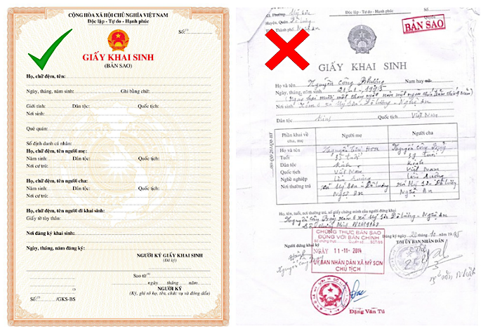

**Xin chào, mình là Hương!** Gia đình mình là vợ Việt chồng Đức. Chúng mình đã kết hôn được hơn một năm và hiện đang sống tại Việt Nam.

Mình từng viết một bài blog chia sẻ chi tiết về hành trình chuẩn bị hồ sơ đăng ký kết hôn với chồng mình – anh là công dân Đức (các bạn có thể đọc thêm về bài viết đó [ở đây](/blog/dang-ky-ket-hon-voi-nguoi-nuoc-ngoai-tai-viet-nam/)). Trong bài viết đó, mình kể lại những trải nghiệm thực tế của gia đình mình khi thực hiện thủ tục tại Việt Nam. Vì chồng mình mang quốc tịch Đức nên việc kết hôn tại Việt Nam được pháp luật Đức công nhận mà không cần phải đăng ký lại tại Đức. Đây là một điều thuận lợi mà mình muốn chia sẻ để các bạn trong hoàn cảnh tương tự có thêm thông tin tham khảo.

Trong bài viết này, mình chia sẻ kinh nghiệm thực tế khi thực hiện thủ tục xin **Giấy chứng nhận kết hôn của Đức** ("Eheurkunde") dành cho các cặp đôi đã kết hôn ở Việt Nam nhưng muốn hôn nhân được ghi nhận trong hệ thống hộ tịch của Đức.

## 1. Ai Có Thể Nộp Đơn?
a. Ít nhất **một người trong hai vợ chồng là công dân Đức** tại thời điểm nộp đơn.

b. Mỗi người có thể nộp riêng, không cần sự đồng ý hay cùng ký của người kia.

c. Nếu muốn tuyên bố thay đổi họ sau kết hôn (ví dụ theo họ chồng/vợ), cả hai người cần cùng ký tên tại cơ quan đại diện ngoại giao của Đức.

## 2. Nộp Đơn Xin Cấp Giấy Chứng Nhận Kết Hôn Của Đức Ở Đâu?
### a. Nếu sống ở Đức:
Nộp đơn tại Standesamt (cơ quan hộ tịch) nơi cư trú.
### b. Nếu sống ở Việt Nam:
Nộp đơn tại:
- [Đại Sứ Quán Đức tại Hà Nội](https://maps.app.goo.gl/XSWzW8zkjaFYv5117): số 29 Trần Phú, Điện Biên, Ba Đình.
- [Tổng Lãnh Sự Quán Đức tại TP. HCM](https://maps.app.goo.gl/yvzh1tSUZ2DQRjbd9): Toà nhà Deutsches Haus, số 33 Lê Duẩn, Bến Nghé, Quận 1.
### c. Đặt lịch hẹn: 
- Tại TP. HCM: Liên hệ trước với Tổng Lãnh sự quán qua [mẫu email này](https://vietnam.diplo.de/dynamic/action/vn-vi/ueber-uns/gk-hcms/1223702/1223702).
- Tại Hà Nội: Liên hệ trước với Đại sứ quán qua [mẫu email này](https://vietnam.diplo.de/dynamic/action/vn-vi/ueber-uns/botschaft/1223758/1223758).

## 3. Cơ Quan Xử Lý Đơn Hồ Sơ
a. Nếu bạn hoặc vợ/chồng có địa chỉ cư trú ở Đức thì Standesamt ở City Hall tại nơi cư trú hoặc nơi ở thường trú sẽ tiếp nhận và xử lý.

b. Nếu không có địa chỉ cư trú tại Đức thì Standesamt I tại Berlin sẽ là nơi xử lý hồ sơ của bạn.

## 4. Quy Trình Thủ Tục Xin Cấp Giấy Chứng Nhận Kết Hôn Của Đức
### Bước 1: Chuẩn bị hồ sơ 
Trước tiên, bạn cần hoàn thiện đầy đủ hồ sơ theo hướng dẫn chi tiết ở Mục 5.
### Bước 2: Gửi hồ sơ để kiểm tra sơ bộ và đặt lịch hẹn
Liên hệ Đại sứ quán hoặc Tổng Lãnh sự quán Đức qua email. Bạn sẽ gửi bản scan các giấy tờ để họ kiểm tra trước. Nếu hồ sơ đầy đủ và hợp lệ, họ sẽ phản hồi và hướng dẫn bạn đặt lịch hẹn nộp hồ sơ trực tiếp.
### Bước 3: Nộp hồ sơ theo lịch hẹn
Đến ngày hẹn, bạn mang theo bản gốc các giấy tờ cùng bản đã hợp pháp hóa lãnh sự đến nộp tại Đại sứ quán hoặc Tổng Lãnh sự quán. Tại đây, bạn cũng sẽ thanh toán lệ phí xử lý hồ sơ.
### Bước 4: Chờ xử lý và nhận kết quả
Sau khi hồ sơ được chuyển đến Standesamt, bạn có thể sẽ được yêu cầu bổ sung thêm tài liệu qua email.
Thời gian xử lý thường mất khoảng 3 – 4 tuần kể từ khi hồ sơ được hoàn thiện đầy đủ.

### Nhận kết quả: 
- Nếu bạn đang ở Đức: Bạn sẽ đến trực tiếp Standesamt để nhận Giấy chứng nhận kết hôn.
- Nếu bạn không có mặt ở Đức: Bạn có thể ủy quyền cho người thân nhận thay. Chỉ cần gửi giấy ủy quyền qua email cho Standesamt kèm thông tin người được ủy quyền. Khi tới nhận, người đó cần mang theo hộ chiếu/thẻ cư trú và bản in giấy ủy quyền. Bạn có thể tham khảo mẫu giấy uỷ quyền trên các trang web online.

> ⚠️ Theo như mình được biết, hiện tại Standesamt chưa hỗ trợ dịch vụ gửi giấy chứng nhận kết hôn qua đường bưu điện, vì vậy cần có người trực tiếp đến nhận.

## 5. Hồ Sơ Cần Chuẩn Bị
| STT |	Tên giấy tờ |	Yêu cầu |
| :-: | :-- | :-- |
| 1 |	Đơn đăng ký |	Đã điền và ký tên. Tải mẫu từ trang chính thức [ở đây](https://vietnam.diplo.de/resource/blob/2511926/d8bf89f46b98d30b18820278828dec70/250502-anzeige-eheschliessung-formular-data.pdf). |
| 2 |	Giấy chứng nhận kết hôn Việt Nam | 1 bản hợp pháp hoá + 1 bản sao + 1 bản dịch thuật sang tiếng Đức bởi dịch giả được công nhận tại Đức. Mang bản gốc để đối chiếu _(mình sẽ nói thêm chi tiết ở phần lưu ý)_. Mang theo giấy tờ gốc để đối chiếu. |
| 3 |	Giấy xác nhận tạm trú của cả 2 vợ chồng |	1 bản sao công chứng và dịch thuật sang tiếng Đức mỗi người. |
| 4 |	Giấy khai sinh gốc của 2 vợ chồng	| Đối với người Việt Nam: 1 bản trích lục khai sinh (đã được hợp pháp hoá) + 1 bản dịch thuật sang tiếng Đức bởi dịch giả chính thức ở Đức _(mình sẽ nói thêm chi tiết ở phần lưu ý)_. |
| 5 |	Hộ chiếu của 2 vợ chồng |	Mang bản gốc để đối chiếu. Không giữ lại. |
| 6 |	Giấy tờ khác (nếu có) |	Nếu đã từng kết hôn trước: giấy kết hôn cũ và quyết định ly hôn (nếu có). Nếu có con chung: giấy khai sinh của các con. |

> ⚠️ Trong một số trường hợp đặc biệt, cơ quan tiếp nhận và/hoặc cơ quan xử lý hồ sơ có thể yêu cầu thêm giấy tờ.

## 6. Yêu Cầu Hợp Pháp Hoá Và Dịch Thuật
a. Tất cả các giấy tờ nước ngoài (ví dụ: của phía Việt Nam như Giấy khai sinh của mình, Giấy chứng nhận kết hôn ở Việt Nam của 2 vợ chồng) phải được **hợp pháp hoá lãnh sự**. (Mình sẽ sớm viết một bài blog chia sẻ trải nghiệm của bản thân khi thực hiện hợp pháp hoá lãnh sự giấy tờ tại Việt Nam, các bạn đón chờ nhé!)

b. Các giấy tờ không viết bằng tiếng Anh hoặc tiếng Đức phải được dịch thuật sang tiếng Đức bởi dịch giả công chứng. Một số giấy tờ có tiếng Anh có thể được chấp nhận mà không cần dịch (tùy Standesamt).

## 7. Lệ Phí Tại Đại Sứ Quán Hoặc Tổng Lãnh Sự Quán Đức Tại Việt Nam
### a. Lệ phí tại Đại sứ quán hoặc Tổng Lãnh sự quán Đức tại Việt Nam:
- Chứng nhận bản sao (Beglaubigung von Fotokopien): 25,75 Euro.
- Chứng nhận chữ ký (Beglaubigung der Unterschriften): 56,43 Euro (nếu bạn có nhu cầu thay đổi họ thì mức phí này sẽ là: 79,57 Euro).
### b. Lệ phí tại Standesamt:
- Phí xử lý hồ sơ: 110 Euro.
- Phí cấp Giấy chứng nhận kết hôn: 20 Euro/bản.

Gia đình mình xin 3 bản tiếng Đức và 2 bản quốc tế, tổng chi phí phần này: 100 Euro.

## 8. Một Số Lưu Ý Quan Trọng
a. **Không có thời hạn bắt buộc** để nộp đơn xin giấy kết hôn của Đức, bạn có thể làm bất cứ lúc nào.

b. **Trích lục khai sinh** phải xin tại UBND nơi đăng ký khai sinh, không dùng bản photo công chứng.

c. Nếu bạn có bất kỳ vướng mắc gì trong quá trình chuẩn bị giấy tờ, hãy liên hệ ngay với Standesamt, Đại sứ quán hoặc Tổng Lãnh sự quán Đức (tuỳ thuộc vào việc bạn đang ở bước nào trong quá trình nộp hồ sơ) để được tư vấn thêm.
- Trước khi nộp hồ sơ: Liên hệ Đại sứ quán hoặc Tổng Lãnh sự quán Đức.
- Sau khi nộp hồ sơ: Liên hệ Standesamt (lưu ý: bạn chỉ nên liên hệ với Standesamt khoảng một vài tuần sau khi nộp hồ sơ tại Đại sứ quán hoặc Tổng lãnh sự quán Đức vì đây là khoảng thời gian mà hồ sơ được gửi từ Việt Nam sang Đức).

d. Khi tới Đại sứ quán hoặc Tổng Lãnh sự quán để nộp giấy tờ, có một vài lưu ý nhỏ mình muốn chia sẻ như sau:
- Hãy **tới điểm hẹn trước khoảng 15 phút** để thực hiện kiểm tra thông tin cá nhân và kiểm tra an ninh. Bạn không nên đến quá sớm hoặc quá muộn nhé, vì tới sớm quá thì sẽ phải đợi ở ngoài, còn tới muộn thì bị huỷ lịch hẹn.
- Luôn **in 1 bản email xác nhận lịch hẹn** với Đại sứ quán hoặc Tổng Lãnh sự quán. Khi tới nơi, cán bộ ở khu vực ngoài sẽ tiếp nhận giấy này và kiểm tra hộ chiếu để xác nhận thông tin cá nhân.
- Phí được quy đổi sang tiền Việt Nam Đồng theo tỷ giá hàng ngày của cơ quan đại diện. Đại sứ quán và Tổng Lãnh sự quán Đức chỉ thu các loại phí bằng tiền mặt VNĐ (đổi theo tỉ giá lúc bạn nộp hồ sơ) nên **hãy mang theo tiền mặt**. Nếu bạn quên tiền mặt ở nhà hoặc không mang đủ số tiền thì đừng lo lắng, cán bộ tiếp nhận sẽ cho phép bạn đi ra cây ATM gần nhất để rút tiền và quay lại thanh toán dịch vụ.
- Các thiết bị điện tử như điện thoại, đồng hồ thông minh, máy tính xác tay, v.v… và hành lý quá khổ không được phép mang vào khu vực làm việc của Đại sứ quán hoặc Tổng Lãnh sự. Họ sẽ cung cấp cho các bạn 1 ngăn tủ có khoá nhỏ để bạn cất thiết bị điện tử. Do vậy, **đừng mang theo hành lý quá khổ hoặc các thiết bị điện tử lớn** nhé.

## 9. Kinh Nghiệm Thực Tế Của Bọn Mình
Sau khi bọn mình nộp hồ sơ tại Tổng Lãnh sự quán Đức ở TP. HCM, hồ sơ được gửi về Standesamt tại nơi thường trú của chồng mình ở Đức. Standesamt đã liên hệ bọn mình và **yêu cầu bổ sung bản dịch tiếng Đức do dịch giả chính thức tại Đức** (officially authorized, appointed and sworn-in translators) thực hiện, bao gồm:
- Giấy đăng ký kết hôn Việt Nam, và
- Trích lục khai sinh của mình.

> Bạn có thể tìm thông tin và liên hệ với dịch giả chính thức tại Đức qua website: [Database of translators and interpreters](https://www.justiz-dolmetscher.de/Recherche/en/Suchen/).

Thời gian xử lý hồ sơ xin giấy chứng nhận kết hôn của Đức của tụi mình: Khoảng **4 tuần** kể từ khi nộp hồ sơ, bao gồm cả thời gian hoàn tất dịch thuật.

## Kết Luận

Hy vọng chia sẻ trên giúp bạn chuẩn bị tốt hơn cho thủ tục xin giấy chứng nhận kết hôn của Đức. Nếu có câu hỏi hay thắc mắc gì, bạn hãy liên hệ với mình qua [trang Facebook](https://www.facebook.com/huongdo.dthn) này nhé!
> 😄 Đừng quên theo dõi blog để đọc thêm về **thủ tục hợp pháp hoá lãnh sự giấy tờ** sắp tới mình sẽ chia sẻ!
