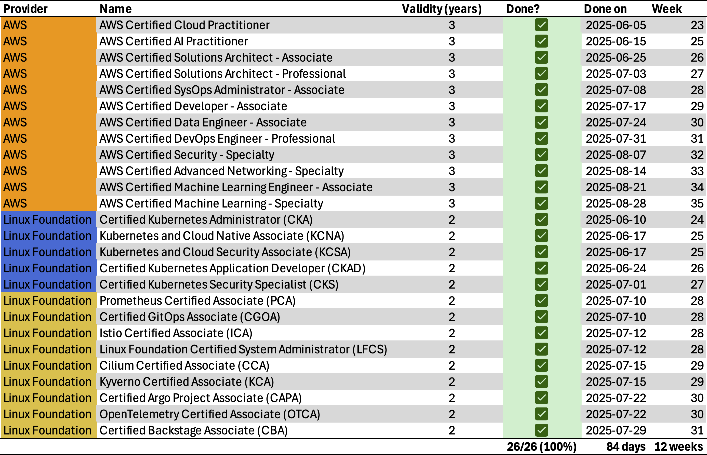

## What's going on?
A couple of months ago my friend and I were talking and got onto the topic of certifications, specifically AWS and Kubernetes.

Now, I'll be the first to admit that I have considered (and probably still am considering) certifications an optional goodie on your CV. If I'm considering a candidate for a position, I'm looking at your relevant work experience first and foremost. Any certifications listed are usually just the cherry on top of an already impressive candidate. Certifications can in no way replace hands-on work experience. They are an eye-catcher on your CV though and may get your foot in the door with the relevant hiring manager who's reviewing your CV. That also means your foot (along with the rest of your body) will promptly be removed from any corporate office interior during the technical interview if you can't back up the skillset your certifications supposedly prove you possess.

You might be asking: "Niels, if you don't put great emphasis on certifications in candidate selection, why would you go through the trouble of getting certifications yourself?"

Ah, yes. Well, let's go back to the discussion with my friend (Remember? The one I opened this paragraph with). He said you could get some swag. For the AWS Golden Jacket that would be... well... the golden jacket. And for the CNCF Golden Kubestronaut you'd also get a jacket, backpack and beanie along with some other goodies.

Yes... I'm easy to get. I know, I know. But hear me out. To run a business, one needs... drumroll please... people who will buy what one is selling. Given that 100% of my current business is project-based, which means reaching out to potential clients, convincing them to hire my company to solve their business problem and providing a high-quality solution (as well as ongoing support if the cooperation was mutually satisfactory), I must be distinct from the crowd.

One way to stand out to clients is through certifications. I won't judge if that's good or bad here, there'll be a time and place for that. For now, we'll just accept that reality.

But I'll also be honest: Going through the effort of not just getting all those certifications but to have to do all of that again every two or three years. Now that is something I'm hesitant about. That's why that swag is important to me. It allows me to stand out in the crowd (on a conference, meetup or whatever social(-ly awkward, let's be real. We're talking about an engineer with the social skills of a broomstick here...) situation I may find clients in. Given that the Golden Kubestronaut is for life and AWS won't send the authorities to your house to reclaim the golden jacket should you fail to renew your certificates, that seemed like a good deal to me.

I should also note that I didn't choose those two domains willy-nilly. Most of my current work is done in and around AWS and Kubernetes. Therefore, these certification paths were the most logical as there is a significant overlap between the skills required for the certification and the skills obtained and used within my day-to-day work.

Let's quickly recap what the CNCF Golden Kubestronaut and AWS Golden Jacket are and how to earn them for the uninitiated.

### Who is a CNCF Golden Kubestronaut?
A CNCF Golden Kubestronaut is a person who has completed all CNCF certifications in addition to the Linux Foundation Certified SysAdmin exam. At the time of completing the Golden Kubestronaut, those were:
- The Kubestronaut bundle:
  - Kubernetes and Cloud Native Associate (KCNA)
  - Kubernetes and Cloud Native Security Associate (KCSA)
  - Certified Kubernetes Application Developer (CKAD)
  - Certified Kubernetes Administrator (CKA)
  - Certified Kubernetes Security Specialist (CKS)
- as well as the remaining certifications:
  - Certified Argo Project Associate (CAPA)
  - Certified Backstage Associate (CBA)
  - Certified GitOps Associate (CGOA)
  - Cilium Certified Associate (CCA)
  - Istio Certified Associate (ICA)
  - Kyverno Certified Associate (KCA)
  - Linux Foundation Certified SysAdmin (LFCS)
  - OpenTelemetry Certified Associate (OTCA)
  - Prometheus Certified Associate (PCA)

### Who is an AWS Golden Jacket?
While there is no official documentation from AWS, it is understood in the community that anyone who holds all current AWS certifications at the same time is eligible for an AWS Golden Jacket.

Caveat: Based on several reports from friends who have an AWS Golden Jacket, another (not so obvious) requirement is that you also need to be working for an AWS Partner company when requesting the golden jacket. More on that later.

At the time of completing the AWS Golden Jacket, the relevant certifications were:
- Practicioner
  - Cloud (CLF-C02)
  - AI (AIF-C01)
- Associate
  - SysOps Administrator (SOA-C02)
  - Date Engineer (DEA-C01)
  - Machine Learning (MLA-C01)
  - Developer (DVA-C02)
  - Solutions Architect (SAA-C03)
- Professional
  - DevOps Engineer (DOP-C02)
  - Solutions Architect (SAP-C02)
- Specialty
  - Machine Learning (MLS-C01)
  - Security (SCS-C02)
  - Advanced Networking (ANS-C01)

## My timeline
Because completing 26 certifications isn't hard enough on its own, I decided to challenge myself with a time limit. 12 weeks. Start to finish. Why 12? Well, the idea was to complete one AWS certification per week. AWS has 12 certifications. Ergo 12 weeks.

But why make it harder on myself? Well, it was clear from the beginning that achieving all certifications will incur significant cost. I also knew that during September and October I'd be traveling and therefore unable to complete any certification. And knowing myself, getting back into the grind and certification mindset after two months of downtime would be difficult to say the least.

So that meant exactly one AWS certification per week and one CNCF certification per week in the beginning and two weeks where I'd have to complete two CNCF certifications (because CNCF had 14 certifications in total).

Let me put a picture here. This wall of text is getting monotonous.

As you can see, I started on June 5th and finished on August 28th. I've sorted by provider (AWS/CNCF) first to make the relevant groups a bit easier to understand.

I don't think I need do elaborate on the timeline for AWS further. As discussed, one certification per week. Starting easy, getting harder along the way and finally finishing on the pair of Machine Learning exams. (I'll discuss the order of exams in a bit.) Moving on? Moving on!

More interestingly, let's take a closer look at CNCF.

> I was more relaxed taking the CNCF exams with less preparation because one free retake is included in the exam fee.

As you can see, I started with the CKA just to get a feel for the performance-based exams and then mixed in the KCNA and KCSA as the first multiple-choice exams. Since the multiple-choice exams for CNCF are 90 minutes each, they can be grouped together quite nicely for a morning session. That was the general ethos for the other multiple-choice exams as well. I tried to group them to finish two in a morning. This strategy not only made scheduling easier but also helped me accelerate my pace, allowing me to complete all CNCF exams in 7 weeks instead of 12.

> The performance-based/interactive exams are significantly more fun than the multiple-choice exams. Who would've thought...

## Preparation
Now I'm sure you are positively itching to find out how I prepared for all of this. You might be right on the edge of your seat, impatiently wobbling back and forth. The wooden chair squeaking under your weight. Fingernails digging into your thighs, tense with anticipation and the need to use the bathroom because this blog has been going on for so long already without getting to the meat, just digging and digging, cutting away layers of skin... Ok, I'll stop. Apologies.

Practice exams and the killer.sh exam simulator to be honest. There isn't much more to it unfortunately. Yes, of course, having hands-on experience with the relevant tools and services will help significantly. But you can certainly pass all AWS exams (and maybe all CNCF exams) without immediate hands-on experience. The CNCF practice exams available on Udemy are very hit-or-miss. I found only one that covered most (if not all) of the topics relevant for the exam.

That was the [Prometheus Certified Associate Practice Exams](https://www.udemy.com/share/107BfA3@BcivUXmlS8hOigP2XTcH7QHOMDcQkV8tMfl6jZeo6Ng1n1BNxTYGNL4s3iXpWXaygA==/) course on Udemy.

For the other CNCF certifications my immediate recommendation is: Use the tool in question. You want to do the Kyverno Certificated Associate (KCA)? Set up a minikube cluster, install Kyverno, play around with it. And I don't mean play around for two minutes and put it away. I mean read through the documentation, understand the capabilities, understand the CRDs, annotations, CLI if applicable. Go through some example use cases (or think of some use cases by yourself and implement them).

And here's a trick that the reptilians don't want you to know about: You can see the content of the exam. Yes, it's incredible. It's almost cheating. Let's look at the [overview page of the Kyverno Certified Associate on the Linux Foundation Education website](https://training.linuxfoundation.org/certification/kyverno-certified-associate-kca/).

What's that? Domains & Competencies? Yes, it is what you think it is. A list of all the topics you may be asked about. And what do you do with all of that? You read it and for everything that you haven't seen before: You go to the documentation, search for that thing and study it (with hands-on experience of course) until you understand it. Rince and repeat.

## Difficulties
Let's move on to some difficulties that I had. Yes, even though I may be the GOAT, women love him, men want to be him, I still have flaws (representation not to scale, limited liability applies in case of misrepresentation of facts).

Unsurprisingly, the exams where I had no (or at least not much) hands-on experience had me sweating profusely. For me that would be:
#### Cilium Certified Associate (CCA)
While I am using Cilium for most of my newer Kubernetes environments, my use case only scratches the surface of what Cilium can do. Some of the exam questions required in-depth knowledge of the Cilium architecture and networking stack that I simply didn't have from my limited hands-on experience.

#### Linux Foundation Certified SysAdmin (LFCS)
No internet search. Only `man`. If you know exactly what you are looking for that is great. But the number of times I wished for a couple of examples on the `man` page... The content of the exam isn't difficult per se. The lack of documentation makes it challenging however, especially when compared to the other performance-based CNCF exams (CKAD, CKA, CKS and ICA).

#### AWS Date Engineer - Associate (DEA-C01)
#### AWS Machine Learning - Associate (MLA-C01) and Machine Learning - Specialty (MLS-C01)
#### AWS Advanced Networking - Specialty (ANS-C01)
Those four were difficult for me for the same reason: I'm not a Data Engineer; I'm not a Machine Learning engineer and I didn't have relevant hands-on experience with the AWS services in question (for Advanced Networking that would've mostly been Direct Connect and Transit Gateway).

After finishing the Data Engineer - Associate exam I decided to move Machine Learning - Associate and Specialty to the very end. It was also at the point that I marked those two Machine Learning certifications as "optional" in my head. If I hadn't passed either of those, my AWS certification journey would've ended at that point and I would've accepted that. If it had turned out that the ML exams required weeks (or maybe even months) of hands-on preparation in a field that I don't actively work in (and don't want to specialize in for that matter), the time investment wouldn't have made sense for me.

### Pricing
Let's talk a bit about pricing. And I'm not just talking about the direct (visible) cost of the exams themselves, although that is also a significant position.

If you buy all exams for the regular price you're looking at:

|Provider|Name|Price|Validity (years)|Price/year|
|-|-|--:|--:|--:|
|AWS|AWS Certified Cloud Practitioner| $100,00 |3| $33,33 |
|AWS|AWS Certified AI Practitioner| $100,00 |3| $33,33 |
|AWS|AWS Certified Solutions Architect - Associate| $150,00 |3| $50,00 |
|AWS|AWS Certified SysOps Administrator - Associate| $150,00 |3| $50,00 |
|AWS|AWS Certified Developer - Associate| $150,00 |3| $50,00 |
|AWS|AWS Certified Data Engineer - Associate| $150,00 |3| $50,00 |
|AWS|AWS Certified Machine Learning Engineer - Associate| $150,00 |3| $50,00 |
|AWS|AWS Certified Solutions Architect - Professional| $300,00 |3| $100,00 |
|AWS|AWS Certified DevOps Engineer - Professional| $300,00 |3| $100,00 |
|AWS|AWS Certified Security - Specialty| $300,00 |3| $100,00 |
|AWS|AWS Certified Advanced Networking - Specialty| $300,00 |3| $100,00 |
|AWS|AWS Certified Machine Learning - Specialty| $300,00 |3| $100,00 |
|Linux Foundation|Kubernetes and Cloud Native Associate (KCNA)| $250,00 |2| $125,00 |
|Linux Foundation|Kubernetes and Cloud Security Associate (KCSA)| $250,00 |2| $125,00 |
|Linux Foundation|Certified Kubernetes Application Developer (CKAD)| $445,00 |2| $222,50 |
|Linux Foundation|Certified Kubernetes Administrator (CKA)| $445,00 |2| $222,50 |
|Linux Foundation|Certified Kubernetes Security Specialist (CKS)| $445,00 |2| $222,50 |
|Linux Foundation|Prometheus Certified Associate (PCA)| $250,00 |2| $125,00 |
|Linux Foundation|Certified GitOps Associate (CGOA)| $250,00 |2| $125,00 |
|Linux Foundation|Istio Certified Associate (ICA) | $250,00 |2| $125,00 |
|Linux Foundation|Cilium Certified Associate (CCA)| $250,00 |2| $125,00 |
|Linux Foundation|Kyverno Certified Associate (KCA)| $250,00 |2| $125,00 |
|Linux Foundation|Certified Argo Project Associate (CAPA)| $250,00 |2| $125,00 |
|Linux Foundation|OpenTelemetry Certified Associate (OTCA)| $250,00 |2| $125,00 |
|Linux Foundation|Certified Backstage Associate (CBA)| $250,00 |2| $125,00 | 
|Linux Foundation|Linux Foundation Certified System Administrator (LFCS)| $445,00 |2| $222,50 |
|||**$6.730,00**| | **$2.956,67**|

Now that's a number. Let me make that perfectly clear: If you don't have a sponsor, you shouldn't do these exams. Paying this personally makes no sense. Ask your employer to pay for these exams (at least partially).

Luckily, AWS will gift you a 50% discount voucher if you pass an exam which you can use for the next exam or when renewing the exam three years down the line. That will reduce the cost from $2.450,00 to $1.275,00

For CNCF, if you are reasonably sure that you want (and can) complete either the Kubestronaut or the full Golden Kubestronaut, I suggest buying the respective exam bundle instead of the individual exams.

Buying the Golden Kubestronaut Bundle is $3.850,00 at the time of writing, whereas buying the exams included in the bundle individually is $4.530,00. Already a 15% discount. But you can go even further with discount/voucher codes. Give the old search engine some love and look for CNCF or Linux Foundation discount codes. I'm sure it won't take you long to find some that offer up to an additional 30% discount.

### Houston, we have a problem.
Unfortunately, I must join a seemingly long list of complainants regarding CNCF's technical issues. Both the remote desktop environments and multiple-choice exam browser had frequent issues with latency. Two times the exam crashed outright. That happened during the CKA exam, where I was disconnected from the remote desktop (likely due to a short ISP outage on my end) and spent the next 30 minutes trying to get back into the exam. Note that the timer didn't stop while I was disconnected. That meant I had to complete the CKA exam, which is designed for 120 minutes, in about 90.

A similar issue happened during the Prometheus Certified Associate, where I was **logged out** of the testing website. HTTP 403, please log in again. At least the timer was paused while I was disconnected, so after completing the check-in process again everything was as I left it.

I'll commend the AWS testing environment (or rather Pearson VUE). I haven't experienced any technical difficulties during the AWS exams.

## Learnings
As I outlined in the beginning, certifications on their own don't make a great engineer. I'm not a Machine Learning engineer and I was able to pass the Machine Learning exam. I don't have any hands-on experience with AWS SageMaker or Bedrock. Would I feel comfortable charging a client to help with a ML related problem? Absolutely not. That's not how I do business. I'm happy to have you as a client if I can meaningfully help you by solving your problems. If I can't, then we won't be working together.

Having said that, the exams where I did have prior knowledge and hands-on experience with the relevant services were not only more fun but also taught me some insights that I may not have come across had I just kept using the service "normally." So, there is something to be said about enhancing your existing skills through relevant certifications.

## The good, the bad and the ugly

### CNCF: Non-personal communication
There aren't that many Golden Kubestronauts (around 100). There aren't that many Kubestronauts for that matter (around 2.000). There is no reason why the congratulatory email one receives after completing either of these shouldn't be personalized. Currently the email doesn't even start with "Hello &lt;Firstname&gt; &lt;Lastname&gt;" which really takes away from the joy of completing this achievement.

### CNCF: Shipping for the Golden Kubestronaut swag
Staying on the topic of the Golden Kubestronaut: Swag. Especially shipping. I understand, given the current rate of new Kubestronauts, that shipping each jacket individually is expensive. Granted. I won't challenge this decision. But the Golden Kubestronaut swag? Please consider that Golden Kubestronauts may have spent around $3.850 on exams already. And you can't find the spare change for shipping? Look, I'm not educated on the inner workings and the overhead these certification programs entail. I'll give CNCF/the Linux Foundation the benefit of the doubt and presume the profit margin isn't huge. But still... shipping can't be that prohibitively expensive.

> I'm happy to be educated on this point if my expectation and estimation of shipping cost is completely unreasonable.

### AWS: Golden Jacket only for AWS Partners?
Moving on to AWS. It was my initial understanding that the only condition to be eligible for the AWS Golden Jacket was to hold all current AWS certifications at the same time. Turns out, apparently you also need to work for an AWS Partner company. AWS Partner you say. Really? Why? The baseline requirement is the same either way. And that part is the accomplishment. What exactly differentiates my achievement from someone else who happens to be working for an AWS Partner while completing the certifications?

### Proctor Service Support (AWS with Pearson VUE/CNCF with PSI)
The level of support on both sides was shameful. Plain and simple. Technically inaccurate. Seemingly uninterested to help on the phone. Dismissive. I'm not sure if I need to or should elaborate further. Everyone who has experienced lackluster customer support will understand.

## What's next?
This was a high-level overview of everything that I had in my mind about these exams. My goal was to provide a starting point for you to guide further research or to get started with the exam preparations.

In upcoming blog posts, I want to dive a bit deeper into individual areas of the exams, especially the preparation and which content to look out for, some pitfalls I noticed as well as an overview of the exam difficulties with a focus on your learning plan.

There's more coming, so stay tuned.

In the meantime, please feel free to send me a message on [LinkedIn](https://www.linkedin.com/in/niels-heidbrink/) if you have any further questions.

Some goodies... *CNCF-Y9X2J-4M8H6 | CNCF-619GZ-RH44B | CNCF-MKK7L-GWNTY | CNCF-V5HUI-71RNX | CNCF-F2URW-I83VN*
