**Xin chào, mình là Hương!** Gia đình mình là vợ Việt chồng Đức.

Sau loạt bài viết chia sẻ về [Kinh Nghiệm Xin Giấy Chứng Nhận Kết Hôn Của Đức tại Việt Nam](/blog/giay-chung-nhan-ket-hon-cua-duc-tai-viet-nam/) và [Lấy chồng Tây ở Việt Nam - Hướng dẫn đăng ký kết hôn 2025](/blog/dang-ky-ket-hon-voi-nguoi-nuoc-ngoai-tai-viet-nam/), mình nhận được khá nhiều câu hỏi về thủ tục **hợp pháp hóa lãnh sự giấy tờ Việt Nam để sử dụng tại Đức**.

Vì vậy, trong bài viết này, mình tổng hợp lại toàn bộ quy trình mình từng làm thực tế ở cả Hà Nội và TP.HCM, để bạn nào đang chuẩn bị hồ sơ đi du học, định cư, đoàn tụ, hoặc đăng ký kết hôn tại Đức có thể tự tin tự làm.

## I. Hợp Pháp Hoá Lãnh Sự Giấy Tờ Việt Nam Là Gì?
Hiểu đơn giản thì hợp pháp hoá lãnh sự là quá trình xác minh, chứng nhận nguồn gốc của tài liệu, bao gồm xác thực con dấu, chữ ký và chức danh trên giấy tờ do Việt Nam cấp để giấy tờ đó có giá trị sử dụng tại nước ngoài (cụ thể là Đức trong trường hợp này).

Vì Đức và Việt Nam chưa ký [Công ước Hague (Apostille)](https://thuvienphapluat.vn/van-ban/Bo-may-hanh-chinh/Cong-uoc-xoa-bo-viec-hop-phap-hoa-giay-to-cong-vu-cua-nuoc-ngoai-582403.aspx) nên bạn phải thực hiện 2 bước chính:
1. Chứng nhận lãnh sự tại Bộ Ngoại giao Việt Nam.
2. Hợp pháp hoá lãnh sự tại Đại sứ quan Đức hoặc Tổng Lãnh sự Đức.

Chỉ khi hoàn tất 2 bước này, giấy tờ của bạn mới có thể dùng để nộp hồ sơ cho các cơ quan tại Đức.

## II. Các Loại Giấy Tờ Thường Cần Hợp Pháp Hoá Để Sử Dụng Tại Đức
Thông thường, các giấy tờ Việt Nam cần được hợp pháp hóa để có thể sử dụng tại các cơ quan có thẩm quyền của Đức, bao gồm:
1. Giấy khai sinh.
2. Giấy đăng ký kết hôn (nếu đăng ký tại Việt Nam).
3. Giấy chứng nhận độc thân.
4. Sổ hộ khẩu/đăng ký tạm trú.
5. Bằng tốt nghiệp, học bạ.
6. Giấy xác nhận nghề nghiệp.
7. Lý lịch tư pháp.
8. Quyết định ly hôn, v.v…
> **Lưu ý**: Trước khi làm, hãy kiểm tra yêu cầu từ phía Đức (cơ quan tiếp nhận, sở ngoại kiều, toà án, v.v…) để biết chính xác họ cần giấy gì, dịch ra sao, và có yêu cầu hợp pháp hóa hay không. Có nơi chỉ cần dịch công chứng, có nơi yêu cầu dịch bởi dịch giả được công nhận tại Đức.

## III. Quy Trình Hợp Pháp Hoá Lãnh Sự Giấy Tờ Việt Nam Để Dùng Tại Đức

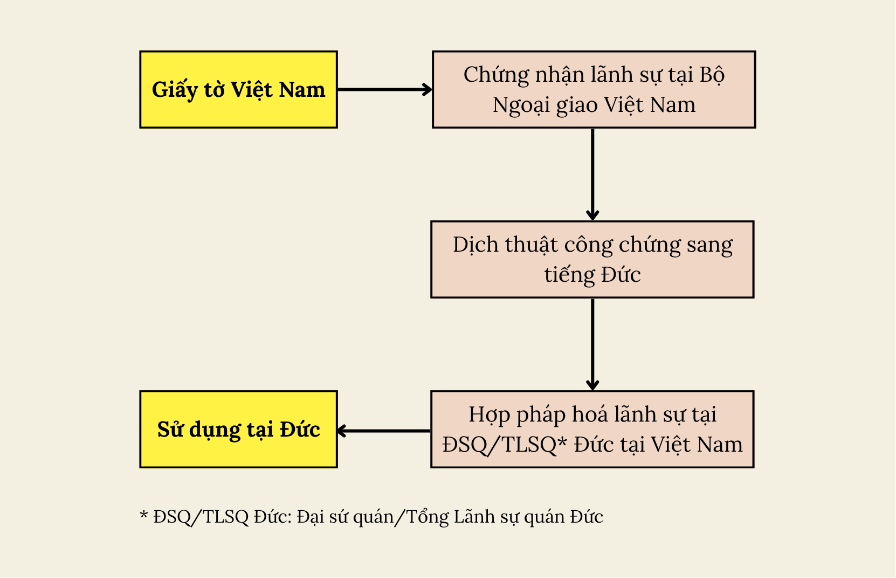

### Bước 1: Chứng Nhận Lãnh Sự Tại Bộ Ngoại Giao Việt Nam

#### Bước 1.1: Đăng ký hồ sơ online đề nghị chứng nhận lãnh sự/hợp pháp hoá lãnh sự
1. Hãy nhấn vào [đường link này](https://dichvucong.mofa.gov.vn/web/cong-dich-vu-cong-bo-ngoai-giao/thu-tuc-hanh-chinh#/thu-tuc-hanh-chinh) để vào Cổng dịch vụ công Bộ Ngoại giao.
2. Chọn **Tạo tờ khai** ở mục 2. Mã thủ tục 1.001308 Thủ tục chứng nhận lãnh sự, hợp pháp hoá lãnh sự giấy tờ, tài liệu.
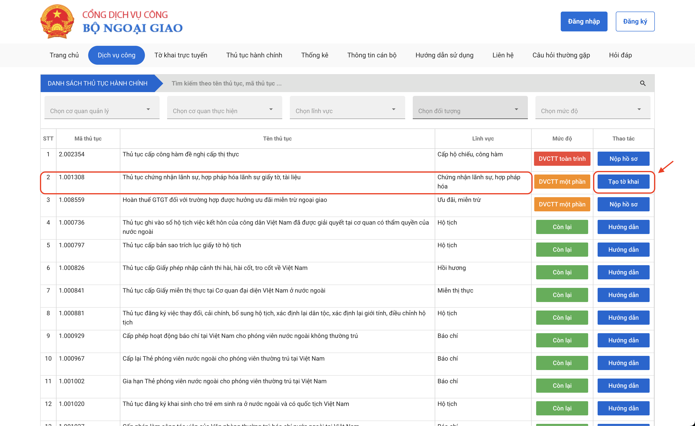
- Nếu bạn có tài khoản VNeID, bạn chọn **Có tài khoản** và đăng nhập vào Cổng dịch vụ công Bộ Ngoại giao bằng tài khoản VneID.
- Nếu bạn là người nước ngoài hoặc công dân Việt Nam không có tài khoản VNeID thì không có tài khoản, nó sẽ dẫn tới tờ khai online luôn.
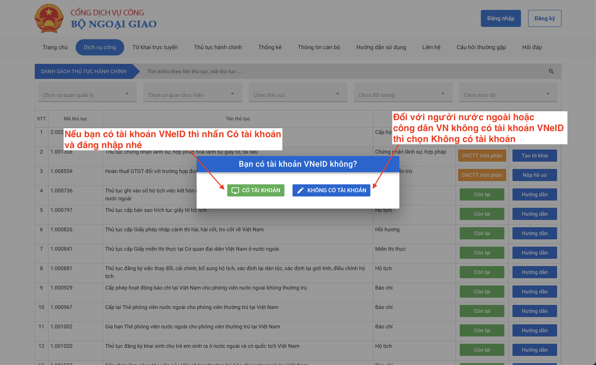
Mình lựa chọn **Có tài khoản** để đăng nhập nhé, vì như vậy một số thông tin cá nhân của mình sẽ được tự động điền trong tờ khai. 
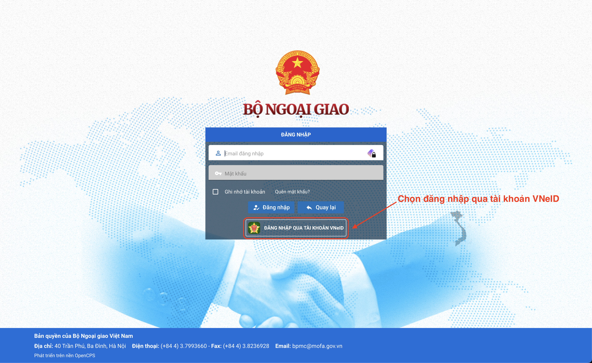
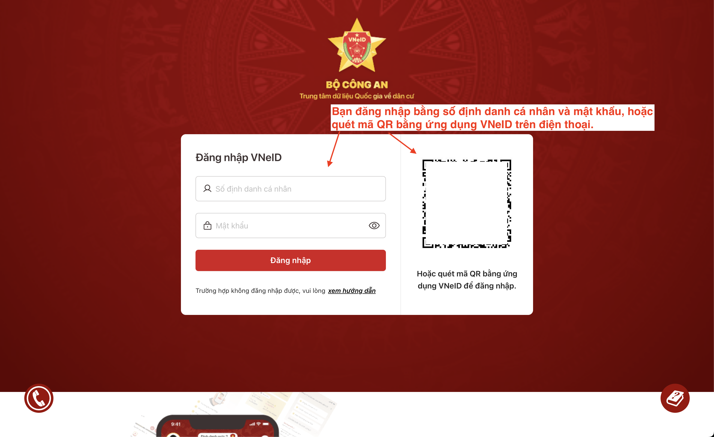
3. Chọn mục **BNG-270817 - Thủ tục chứng nhận lãnh sự, hợp pháp hóa lãnh sự giấy tờ, tài liệu** để bắt đầu thủ tục.
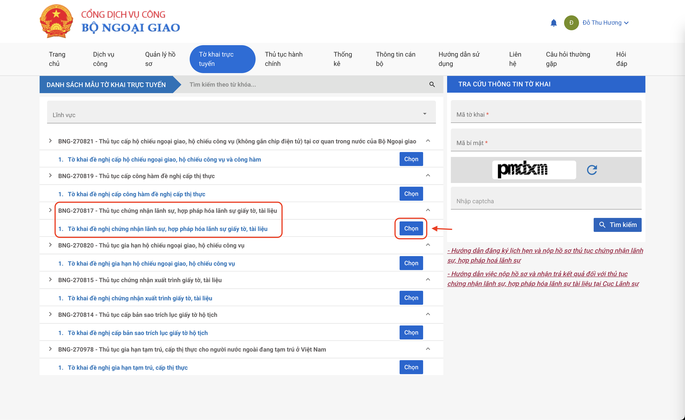
4. Chọn nơi nộp tờ khai:

a. Các giấy tờ được cấp từ Huế trở ra Bắc (chi tiết ở mục IV.3 của bài viết này): Cục lãnh sự Bộ Ngoại giao: 40 Trần Phú, Ba Đình, Hà Nội ([Google Map link](https://maps.app.goo.gl/ttTMWW5Z8cbGStia7)). 

b. Các giấy tờ được cấp từ Huế trở vào Nam (chi tiết ở mục IV.3 của bài viết này): Sở Ngoại vụ thành phố Hồ Chí Minh: 184bis Pasteur, Quận 1, TP. HCM ([Google Map link](https://maps.app.goo.gl/zpRj4uFt8JuEXws18)).
> **Lưu ý**: Dù nội dung tờ khai giống nhau, mỗi nơi có **template khác nhau**. Nếu bạn chọn sai nơi nộp trong quá trình khai báo online thì khi nộp trực tiếp sẽ bị trả hồ sơ.

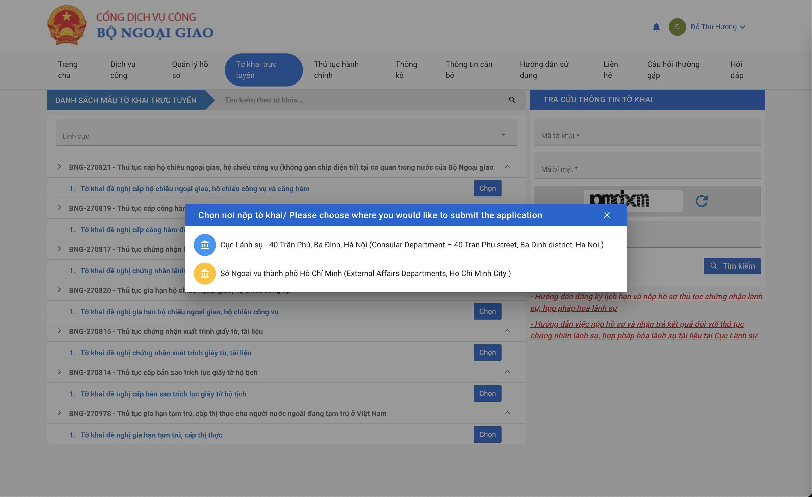
Trong hướng dẫn này mình chọn Cục Lãnh sự ở Hà Nội nhé.

5. Bạn nộp hồ sơ cho ai?

Bạn nộp hồ sơ cho bản thân hay cho đối tượng nào thì nhấn chọn vào mục thích hợp. Bạn có thể di chuột tới từng lựa chọn để đọc giải thích chi tiết.

Mình chọn **Nộp cho bản thân**.
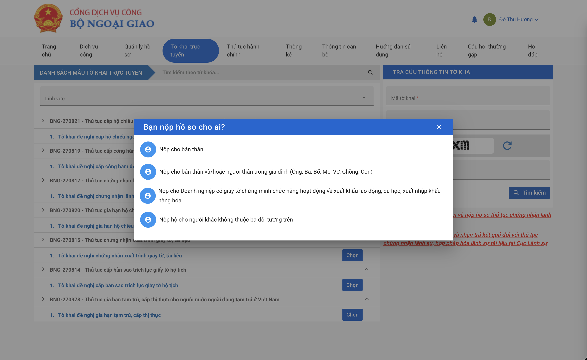
6. Hoàn thành thông tin giấy tờ ở mục 1 Tờ Khai

**a. Mục 1a: Giấy tờ cần chứng nhận lãnh sự/hợp pháp hóa lãnh sự:**

Hãy điền thông tin của từng loại giấy tờ.
- Tên giấy tờ: Giấy chứng nhận độc thân, Giấy chứng nhận kết hôn, v.v… (hãy gõ từ khoá để tìm kiếm ở ô trống cho nhanh nhé)
- Loại giấy tờ: Bản chính, Bản dịch, Bản sao hay Bản trích lục.
- Tổng số bản: Hãy điền số bản bạn cần chứng nhận, hợp pháp hoá lãnh sự của loại giấy tờ này.
- Số hiệu của giấy tờ: Điền số hiệu trên giấy tờ bạn cần chứng, hợp pháp hoá lãnh sự:

Bản chính: số hiệu giấy tờ là số hiệu bản gốc. Nếu bản gốc không có số hiệu: điền số 01. Ví dụ số hiệu của giấy khai sinh/trích lục khai sinh là số hiệu nằm ở góc phải trên cùng.

Bản sao: điền số chứng thực của dấu sao y bản chính của cơ quan công chứng.

- Tên người được cấp giấy tờ: Điền tên của cá nhân được ghi trên giấy tờ. Đối với giấy chứng nhận đăng ký kinh doanh thì sẽ là tên công ty.
- Cơ quan cấp/sao chứng thực: Hãy nhấn vào **Chọn cơ quan/Search** và tìm đúng kết quả như trên giấy tờ (lưu ý một số cơ quan đã thay đổi thông tin sau sáp nhập):

Bản chính: Điền tên cơ quan cấp ghi trên con dấu.
Giấy khai sinh/Trích lục khai sinh: Nơi cấp thường là Uỷ ban Nhân dân phường/xã.

Bản dịch: Điền tên cơ quan ở phần xác nhận bản dịch, thông thường là phòng tư pháp (nhà nước), hoặc văn phòng công chứng (tư nhân).

Bản sao: Bạn xem phần tên cơ quan ghi trong con dấu chứng nhận sao y trùng khớp với bản chính hay bản sao y bản chính.

Giấy chứng nhận đăng ký kinh doanh: Cơ quan cấp thường là Sở kế hoạch đầu tư tỉnh/thành phố trực thuộc trung ương.

- Người ký: Tùy theo mục số 2 - loại giấy tờ mà bạn chọn người ký phù hợp:

Đối với bản chính, bản trích lục: Bạn xem phần tên bên dưới chữ ký và con dấu.

Đối với bản dịch: Bạn xem phần xác nhận bản dịch, thường là trưởng/phó phòng tư pháp.

Đối với bản sao: Bạn xem tên người ký trong dấu/mộc chứng nhận sao y đúng với bản chính hay bản sao y bản chính.
> **Lưu ý**: Để tránh lỗi font, nên viết IN HOA tên người ký.
- Chức danh: Điền tương tự như ở mục 7 - Người ký.
- Ngày ký: Giấy khai sinh, trích lục khai sinh, ngày ký ở phần góc phải bên dưới của giấy tờ.
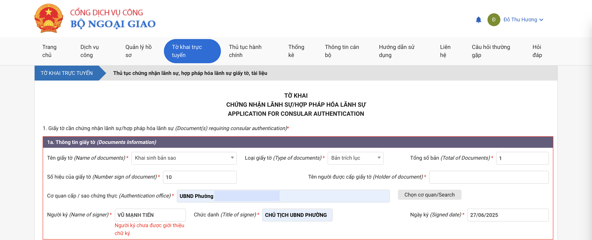

**b. Mục 1b: Thêm giấy tờ vào danh sách:**

Sau khi điền đầy đủ thông tin của giấy tờ ở mục 1a, bạn nhấn chọn **Thêm vào danh sách** để thông tin này được lưu vào mục 1b. Sau đó, bạn tiếp tục điền thêm thông tin mục 1a nếu có thêm các giấy tờ khác cần được chứng nhận/hợp pháp hoá lãnh sự.
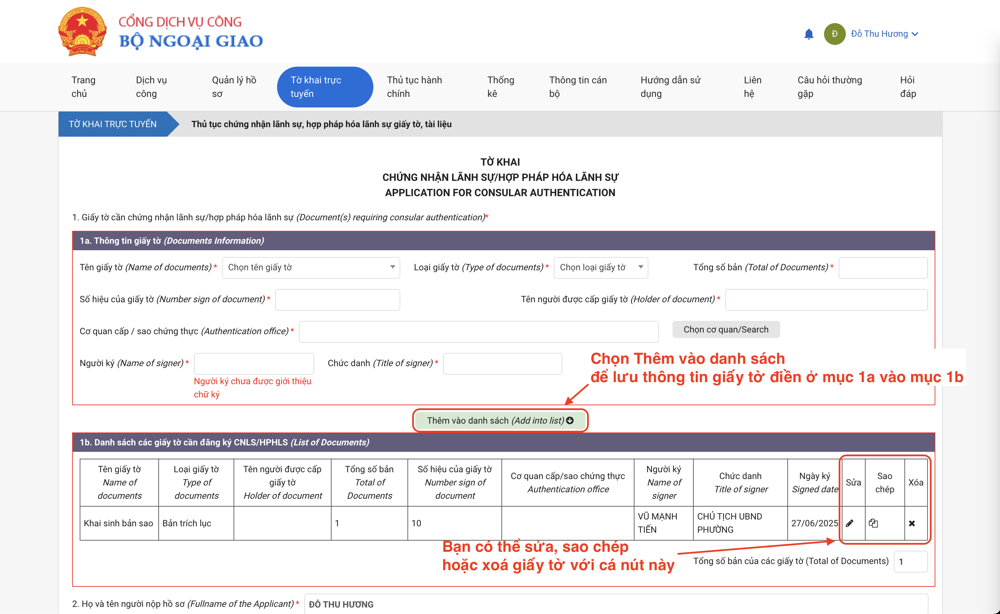

7. Điền thông tin của người nộp hồ sơ ở mục 2, 3, 4 Tờ khai.
   
Hãy đảm bảo điền đầy đủ thông tin của người nộp hồ sơ, bao gồm: Họ và tên, mã số định danh cá nhân, địa chỉ liên lạc, số điện thoại và địa chỉ email.

8. Các thông tin khác trong Tờ khai:

a. Mục 5: Đánh dấu vào ô vuông.

b. Mục 6: Giấy tờ bạn cần chứng nhận, hợp pháp hoá lãnh sự để sử dụng ở nước nào thì chọn nước đó. Ví dụ bạn đang làm hợp pháp hoá lãnh sự trích lục khai sinh để nộp tại Đức thì chọn Đức.

c. Mục 7: Hãy chọn mục đích mà bạn sử dụng giấy tờ được chứng nhận/hợp pháp hoá lãnh sự này: Kết hôn, lao động, v.v…

d. Đánh dấu vào mục **Tôi xin cam đoan…** .

9. Sau khi điền đầy đủ tất cả các thông tin trên, nhấn **Tạo tờ khai**.
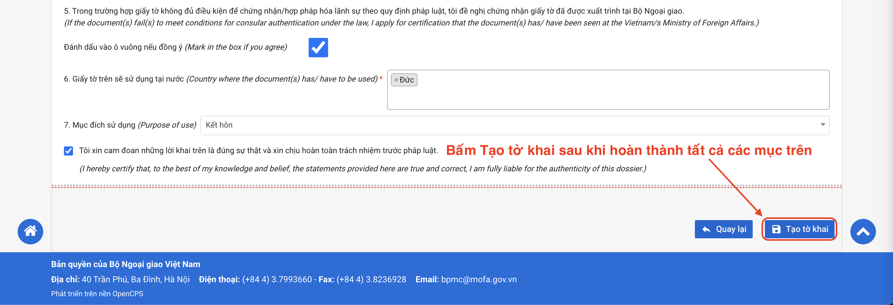
Như vậy, bạn đã hoàn thành tạo Tờ khai chứng nhận/hợp pháp hoá lãnh sự. Bạn hãy ghi lại **Mã tờ khai** và **Mã bí mật** để đặt lịch hẹn online, tra cứu thông tin tờ khai, v.v...

Hãy **tải tờ khai này, in ra và ký tên**.

#### Bước 1.2: Nộp hồ sơ tại cơ quan tiếp nhận
##### 1. Hai hình thức nộp hồ sơ:
**a. Nộp hồ sơ trực tiếp:** Bạn mang hồ sơ giấy tờ đi nộp tại cơ quan tiếp nhận mà bạn đã chọn khi điền tờ khai online.
- Cục Lãnh sự Bộ Ngoại giao ở Hà Nội: 

Thời gian tiếp nhận: Sáng 8:30 AM – 11 AM, chiều 2 PM – 4 PM.

Mặc dù thời gian tiếp nhận hồ sơ như trên nhưng thực tế đến khoảng 9:30 AM và 3 PM đã hết số thứ tự. Bạn nên đặt lịch hẹn online rồi tới ngày hẹn hãy đi sớm trước giờ hẹn khoảng 30 - 45 phút (vì rất đông). Tới nơi thì bạn quét mã vạch trên Tờ khai để lấy số thứ tự.
- Sở Ngoại vụ TP. HCM: 

Thời gian tiếp nhận: Sáng 7:45 AM – 10 AM, chiều 1:15 PM – 3 PM.

Hãy đi thật sớm, trước giờ mở cửa khoảng 15 - 20 phút. Bạn sẽ lấy số thứ tự ở quầy 05, đợi tới lượt và thực hiện thủ tục ở quầy 02, 03, 04.

**b. Nộp qua bưu điện:** Bạn có thể nộp hồ sơ qua bưu điện theo dịch vụ **Hành chính công** tại VN Post hoặc EMS.

##### 2. Các giấy tờ cần chuẩn bị:

| STT | Tên giấy tờ | Yêu cầu |
| :-: | :-- | :-- |
| 1 | Tờ khai chứng nhận/hợp pháp hoá lãnh sự | In 1 bản từ hệ thống. |
| 2 | Giấy tờ tuỳ thân (CCCD/Căn cước/Hộ chiếu) | - Nộp trực tiếp: Mang bản gốc.   - Nộp qua bưu điện: 1 bản sao (không cần công chứng). |
| 3 | Giấy tờ, tài liệu đề nghị được chứng nhận lãnh sự | Bản chính + 1 bản sao mỗi loại. |
| 4 | 1 phong bì rỗng có ghi rõ địa chỉ người nhận | Bắt buộc nếu bạn chọn trả kết quả qua bưu điện hoặc nộp từ xa. |

> Trong một số trường hợp, cán bộ có thể yêu cầu bạn xuất trình thêm bản gốc hoặc giấy tờ liên quan để đối chiếu. 

##### 3. Lệ phí chứng nhận lãnh sự

a. Chứng nhận lãnh sự: 30.000 VNĐ/tem.

b. Phí cấp bản sao giấy tờ, tài liệu: 5.000 VNĐ/tem.

#### Bước 1.3: Nhận kết quả chứng nhận lãnh sự
1. Thời gian xử lý hồ sơ: 1 ngày làm việc.
2. Khi đi nhận kết quả, bạn hãy mang theo **giấy tờ tuỳ thân** và **Giấy tiếp nhận hồ sơ và hẹn trả kết quả** nhé!

**a. Cục Lãnh sự Bộ Ngoại giao ở Hà Nội**: 
- Thời gian trả kết quả: Sáng 8:30 AM – 11 AM, chiều 2 PM – 4 PM.
- Quét mã vạch của Giấy tiếp nhận và trả kết quả hồ sơ để lấy số thứ tự. Ngồi chờ ở trước quầy số 11A và 11B để thanh toán lệ phí. Sau khi đã thanh toán, bạn sẽ ngồi chờ ở quầy số 10 để nhận kết quả.
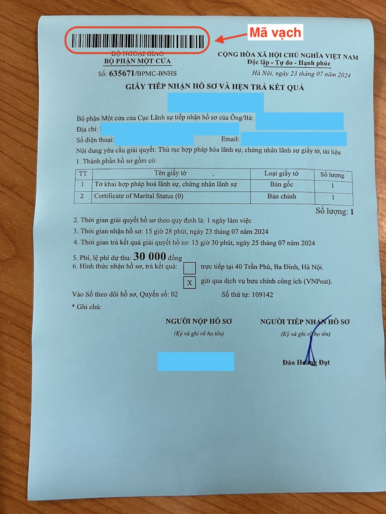

**b. Sở Ngoại vụ TP. HCM:**
- Thời gian trả kết quả: Sáng 9 AM – 11 AM, chiều 3 PM – 4 PM. 
- Bạn nên đến sớm khoảng 10 - 15 phút để lấy số thứ tự nhé.

**Tèn ten! Chúc mừng bạn** 🎉🎉🎉! Bạn đã nhận được tem chứng nhận/hợp pháp hoá lãnh sự của Bộ Ngoại giao ở mặt sau của giấy tờ.

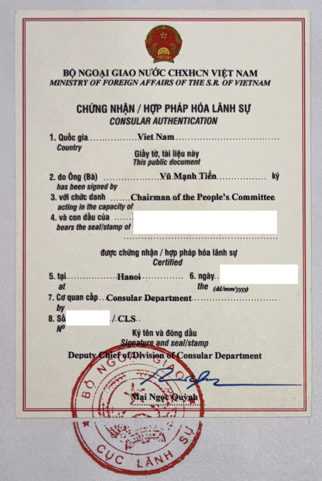

### Bước 2: Dịch Thuật Công Chứng Sang Tiếng Đức

Sau khi đã nhận giấy tờ với chứng nhận lãnh sự, hãy **photocopy thành 2 bản** mỗi loại giấy tờ (1 bản lưu trữ tại nơi dịch thuật công chứng, 1 bản đính kèm bản dịch thuật công chứng) và mang đi dịch thuật công chứng.

#### Dịch thuật công chứng ở đâu?
1. Hà Nội: Bạn có thể làm dịch thuật công chứng tại [Công ty dịch thuật Phú Thịnh](https://maps.app.goo.gl/J4cHA4upncLpBMqT7) (ngay bên kia đường đối diện với Cục Lãnh sự Bộ Ngoại giao). Thời gian thực hiện: 2 - 3 ngày làm việc, có dịch vụ dịch thuật cấp tốc.

2. TP. HCM: Bạn có thể làm dịch thuật công chứng tại UBND Quận. Mình thường ra [UBND Quận 1](https://maps.app.goo.gl/P1HPKXFub7iF92Gv5) trên đường Lê Duẩn làm rất nhanh và chi phí hợp lý. Thời gian thực hiện: 2 ngày làm việc.

### Bước 3: Hợp Pháp Hoá Lãnh Sự Tại ĐSQ/TLSQ Đức Tại Việt Nam

Đây là bước cuối cùng của thủ tục hợp pháp hoá lãnh sự giấy tờ Việt Nam để sử dụng tại Đức. Bạn có thể tự thực hiện nộp hồ sơ đề nghị hợp pháp hoá lãnh sự giấy tờ ở Đại sứ quán hoặc Tổng Lãnh sự quán Đức tại Việt Nam, hoặc uỷ quyền cho người khác nộp hộ.
#### Nơi tiếp nhận hồ sơ và Đặt lịch hẹn:
##### 1. Đại sứ quán Đức:

a. Địa chỉ: 29 Trần Phú, Điện Biên, Ba Đình, Hà Nội ([Google Map link](https://maps.app.goo.gl/Y4eDV8quTFiZsjeY8)).

b. Đặt lịch hẹn:
- Bạn cần đặt lịch hẹn trước qua đường link chính thức của Đại sứ quán Đức [ở đây](https://service2.diplo.de/rktermin/extern/choose_realmList.do?locationCode=hano&request_locale=en).
- Nếu bạn không hiểu rõ tiếng Đức thì hãy chọn biểu tượng lá cờ Anh ở góc trái trên cùng để chuyển sang nội dung tiếng Việt.
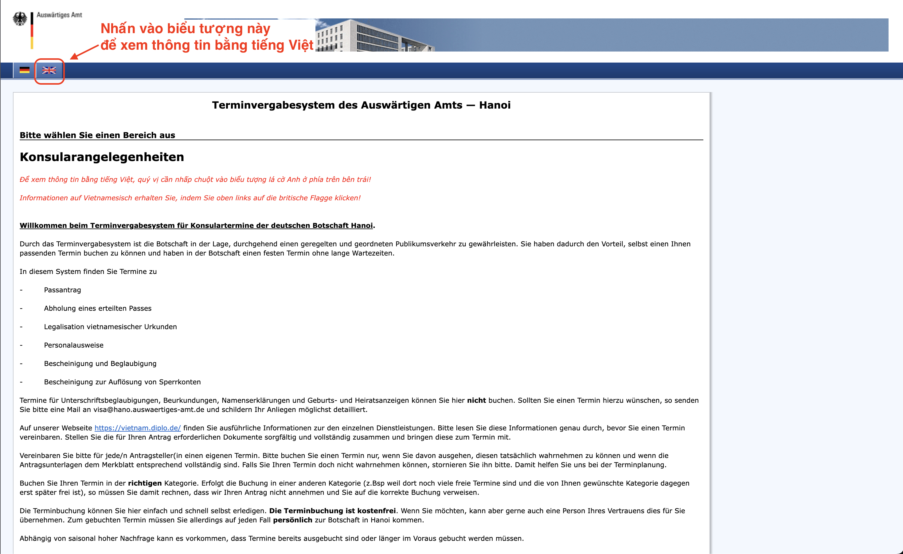
- Nhấn **Continue** ở mục Các dịch vụ lãnh sự để xem lịch trống cho dịch vụ hợp pháp hoá lãnh sự giấy tờ Việt Nam.
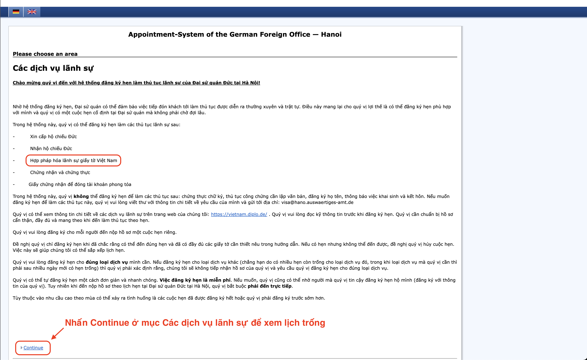

- Tiếp tục thực hiện theo hướng dẫn. Khi tới trang lịch hẹn, bạn chọn ngày và thời gian để nộp hồ sơ. Điền thông tin cá nhân (họ tên, số hộ chiếu, v.v…) để hoàn tất việc đặt lịch hẹn với Đại sứ quán Đức tại Hà Nội.

##### 2. Tổng Lãnh sự quán Đức:

a. Địa chỉ: 33 Lê Duẩn, Bến Nghé, Quận 1, TP. HCM ([Google Map link](https://maps.app.goo.gl/QiVZCTuoYyNbgkTdA)).

b. Đặt lịch hẹn: Bạn có thể nộp hồ sơ hợp pháp hoá lãnh sự giấy tờ tại Tổng Lãnh sự quán Đức trong những khung giờ sau mà **không cần đặt lịch hẹn trước**:
- Thứ Hai, thứ Ba và thứ Năm: 8:30 AM – 9:30 AM.
- Chiều thứ Năm: chỉ tiếp nhận nếu đã đặt hẹn trước.

#### Hồ sơ chuẩn bị:
| STT | Tên giấy tờ | Yêu cầu |
| :-: | :-- | :-- |
| 1 | Hộ chiếu | Bản gốc + 1 bản photo công chứng. |
| 2 | Giấy tờ đề nghị hợp pháp hoá lãnh sự | Bản dịch sang tiếng Đức của giấy tờ đã được chứng nhận lãnh sự + 1 bản photo. |
| 3 | Giấy uỷ quyền | Nếu nhờ người khác nộp hộ. |

#### Lệ phí:
Lệ phí hợp pháp hóa lãnh sự từ ngày 01/07/2025 là **30 Euro/giấy tờ**.

#### Nhận kết quả
Thời gian xử lý hồ sơ thường là 1 tuần, thông tin cụ thể được ghi rõ trên giấy hẹn. Khi bạn tới lấy kết quả, nhớ mang theo **hộ chiếu** và **giấy hẹn**.

🎉 Chúc mừng! Vậy là bạn đã hoàn tất toàn bộ thủ tục hợp pháp hoá lãnh sự giấy tờ Việt Nam để sử dụng tại Đức 🇩🇪

Khi kiểm tra giấy tờ, bạn sẽ thấy tem chứng nhận lãnh sự và dấu xác nhận hợp pháp hóa của Đức được đóng ngay bên cạnh.
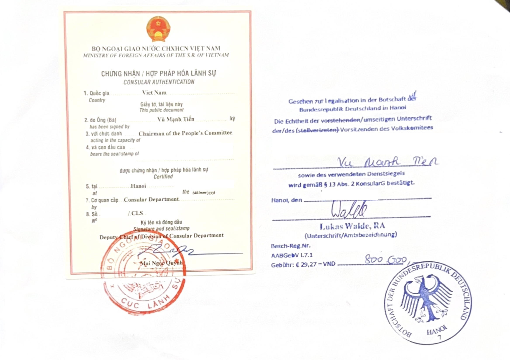

## IV. Một Vài Lưu Ý Quan Trọng Từ Kinh Nghiệm Của Mình
1. Đối với Giấy khai sinh để có thể làm hợp pháp hoá lãnh sự tại Đại sứ quán hoặc Tổng Lãnh sự, bắt buộc phải là bản **trích lục khai sinh** xin tại UBND nơi đăng ký khai sinh, **không dùng bản photo công chứng**. Các loại giấy tờ không được hợp pháp hoá, và được hợp pháp hoá các bạn tham khảo [ở đây](https://vietnam.diplo.de/vn-vi/dichvulanhsu/2490378-2490378) nhé.

 
2.  Nếu bạn chọn nộp hồ sơ xin chứng thực lãnh sự qua **đường bưu điện**, hãy nhớ yêu cầu nộp theo đường **Hành chính công** nhé, vì nếu nộp theo đường bưu điện thường thì hồ sơ sẽ không được tiếp nhận. Đừng quên để thêm 1 bao thư rỗng đã ghi thông tin người nhận là bạn để cho họ gửi kết quả về cho bạn. Phí chuyển phát sẽ do bạn thanh toán.

3. Yêu cầu về nơi nộp hồ sơ xin chứng thực lãnh sự và hồ sơ hợp pháp hoá lãnh sự giấy tờ:

| STT | Cơ quan tiếp nhận | Giấy tờ được cấp tại các tỉnh thành |
| :-: | :-- | :-- | 
| 1 | - Cục Lãnh sự Bộ Ngoại giao (Hà Nội)   - Đại sứ quán Đức (Hà Nội) | Bắc Ninh (hợp nhất Bắc Ninh & Bắc Giang), Cao Bằng, Hà Nội, Hà Tĩnh, Hải Phòng (hợp nhất Hải Dương & Hải Phòng), Tp. Huế, Hưng Yên (hợp nhất Hưng Yên & Thái Bình), Lai Châu, Lạng Sơn, Lào Cai (hợp nhất Lào Cai & Yên Bái), Nghệ An, Ninh Bình (hợp nhất Hà Nam, Ninh Bình & Nam Định), Phú Thọ (hợp nhất Vĩnh Phúc, Phú Thọ & Hòa Bình), Quảng Ninh, Quảng Trị (hợp nhất Quảng Bình & Quảng Trị), Sơn La, Thái Nguyên (hợp nhất Thái Nguyên & Bắc Kạn), Thanh Hóa, Tuyên Quang (hợp nhất Tuyên Quang & Hà Giang). |
| 2 | - Sở Ngoại vụ TP. HCM   - Tổng Lãnh sự quán Đức (TP. HCM) | Các tỉnh An Giang (hợp nhất An Giang & Kiên Giang), Cà Mau (hợp nhất Bạc Liêu & Cà Mau), Cần Thơ (hợp nhất Cần Thơ, Sóc Trăng & Hậu Giang), Đà Nẵng (hợp nhất Quảng Nam & Đà Nẵng), Đắk Lắk (hợp nhất Đắk Lắk & Phú Yên), Đồng Nai (hợp nhất Đồng Nai & Bình Phước), Đồng Tháp (hợp nhất Tiền Giang & Đồng Tháp), Gia Lai (hợp nhất Gia Lai & Bình Định), Thành phố Hồ Chí Minh (hợp nhất Bà Rịa-Vũng Tàu, Bình Dương & Thành phố Hồ Chí Minh), Khánh Hòa (hợp nhất Ninh Thuận & Khánh Hòa), Lâm Đồng (hợp nhất Lâm Đồng, Đăk Nông & Bình Thuận), Quảng Ngãi (hợp nhất Kon Tum & Quảng Ngãi), Tây Ninh (hợp nhất Tây Ninh & Long An), Vĩnh Long (hợp nhất Bến Tre, Vĩnh Long & Trà Vinh). |

4. Mỗi cuộc hẹn với ĐSQ/TLSQ Đức tại Việt Nam chỉ có thể hợp pháp hoá **tối đa 5 giấy tờ**. Nếu bạn muốn hợp pháp hoá nhiều giấy tờ hơn thì phải đăng ký nhiều cuộc hẹn khác nối tiếp theo sao cho phù hợp với số lượng giấy tờ bạn cần làm.

5. ĐSQ/TLSQ Đức chỉ có thể thực hiện nếu giấy tờ cần hợp pháp hoá đã được Cục Lãnh sự Bộ Ngoại giao hoặc Sở Ngoại vụ TP. HCM chứng nhận lãnh sự trước đó.

6. Khi tới ĐSQ/TLSQ Đức để nộp giấy tờ, có một vài lưu ý nhỏ mình muốn chia sẻ như sau:
- Hãy tới điểm hẹn **trước khoảng 15 phút** để thực hiện kiểm tra thông tin cá nhân và kiểm tra an ninh.
- Luôn **in 1 bản email xác nhận lịch hẹn** với Đại sứ quán hoặc Tổng Lãnh sự quán. Khi tới nơi, cán bộ ở khu vực ngoài sẽ tiếp nhận giấy này và kiểm tra hộ chiếu để xác nhận thông tin cá nhân.
- Phí được quy đổi sang tiền Việt Nam Đồng theo tỷ giá hàng ngày của cơ quan đại diện. Đại sứ quán và Tổng Lãnh sự quán Đức chỉ thu các loại phí bằng tiền mặt VNĐ (đổi theo tỉ giá lúc bạn nộp hồ sơ) nên hãy **mang theo tiền mặt**. Nếu bạn quên tiền mặt ở nhà hoặc mang tiếu thì đừng lo lắng, cán bộ tiếp nhận sẽ cho phép bạn đi ra cây ATM gần nhất để rút tiền và quay lại thanh toán dịch vụ.
- Các thiết bị điện tử như điện thoại, đồng hồ thông minh, máy tính xác tay, v.v… và hành lý quá khổ không được phép mang vào khu vực làm việc của Đại sứ quán hoặc Tổng Lãnh sự. Họ sẽ cung cấp cho các bạn 1 ngăn tủ có khoá nhỏ để bạn cất thiết bị điện tử. Do vậy, **đừng mang theo hành lý quá khổ hoặc các thiết bị điện tử lớn** nhé.

## Lời kết: Sau bước hợp pháp hoá là … visa?

Việc hợp pháp hoá giấy tờ là bước đầu quan trọng để chuẩn bị **hồ sơ xin visa Schengen** – loại visa cho phép bạn nhập cảnh vào Đức và các nước châu Âu trong khối Schengen. Nếu bạn đang có dự định xin visa du lịch châu Âu, hãy đón xem bài viết tiếp theo về cách chuẩn bị hồ sơ xin visa Schengen thật chi tiết và thực tế nhé! ❤️