import Spacer from '../../components/Spacer.astro';

**Xin chào, mình là Hương!** Gia đình mình là vợ Việt chồng Đức, tụi mình đã kết hôn được hơn một năm và hiện đang sinh sống tại Việt Nam. 

Mới đây, tụi mình vừa hoàn tất thủ tục **xin visa thăm thân (ký hiệu TT)** cho chồng mình với **thời hạn 1 năm**. Trước đó, chồng mình có thẻ tạm trú doanh nghiệp do làm việc cho một công ty nước ngoài tại Việt Nam. Khi thẻ sắp hết hạn, tụi mình quyết định **chuyển sang visa diện thăm thân**.

Trong bài viết này, mình sẽ chia sẻ **chi tiết quy trình, kinh nghiệm và những lưu ý quan trọng** khi xin **thị thực thăm thân cho người nước ngoài đang sinh sống tại Việt Nam**. Hy vọng sẽ giúp các bạn đang trong hoàn cảnh tương tự có thể chuẩn bị hồ sơ dễ dàng và thuận lợi hơn.

## I. Thị Thực Thăm Thân Là Gì?
1. **Định nghĩa:** 
Visa thăm thân là loại thị thực dành cho người nước ngoài có **thân nhân là công dân Việt Nam** hoặc **người nước ngoài đang cư trú hợp pháp tại Việt Nam**. Mục đích là để đoàn tụ gia đình, chăm sóc người thân hoặc thăm vợ/chồng, cha mẹ, con cái.

2. **Ký hiệu:** Visa TT - áp dụng cho thân nhân đang làm việc, học tập tại Việt Nam.

3. **Đối tượng áp dụng:**
- Người nước ngoài có vợ/chồng là công dân Việt Nam
- Người nước ngoài có cha mẹ, con cái đang sinh sống tại Việt Nam
- Người nước ngoài có nhu cầu đoàn tụ gia đình dài hạn

4. **Thời hạn thị thực thăm thân:** Tối đa 12 tháng.
## II. Quy Trình Xin Visa Thăm Thân
### Bước 1: Chuẩn Bị Hồ Sơ
Xem chi tiết tại **Mục III: Thành Phần Hồ Sơ** bên dưới.

### Bước 2: Nộp Hồ Sơ
1. Truy cập [Cổng Dịch vụ công - Bộ Công an](https://dichvucong.bocongan.gov.vn/?home=1) để nộp hồ sơ online.

2. Hồ sơ sẽ được kiểm tra, xác minh bởi Phòng Quản lý Xuất nhập cảnh Công an tỉnh và Công an xã/phường.

3. Sau khi hồ sơ đạt yêu cầu, bạn sẽ nộp **hồ sơ bản cứng** (trực tiếp hoặc qua bưu điện).

4. Thanh toán phí visa theo thông báo (bọn mình nộp phí 145 USD tương đương 3.748.250 VNĐ cho visa 1 năm, nhiều lần nhập cảnh).

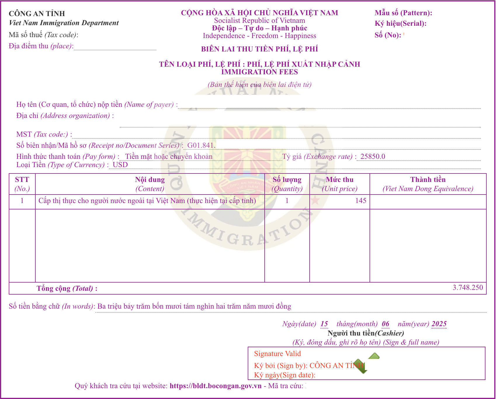

5. Sau khi thanh toán, nhận kết quả tại Phòng Quản lý Xuất nhập cảnh Công an tỉnh hoặc qua bưu điện.
### Bước 3: Nhận Kết Quả
- Sau khoảng 5 ngày làm việc kể từ khi thanh toán, chồng mình đã nhận được visa.
- Khi đi nhận kết quả, người bảo lãnh cần mang theo CCCD bản gốc hoặc người được bảo lãnh mang theo thông tin hẹn và xác nhận thanh toán phí.
## III. Thành Phần Hồ Sơ Xin Visa Thăm Thân
Sau khi thực hiện nộp hồ sơ online theo danh mục thành phần hồ sơ ở trang web Cổng dịch vụ công Bộ Công An, tụi mình đã phải nộp bổ sung thêm **một số giấy tờ khác không được nhắc tới** trên trang web. Vì vậy, dưới đây là **bảng tổng hợp đầy đủ thông tin giấy tờ** bạn cần chuẩn bị.

| STT | Tên giấy tờ | Scan | Sao y công chứng | Bản cứng | Lưu ý |
| :-: | --- | :-: | :-: | :-: | --- |
| 1 | Đơn xin visa Việt Nam (mẫu NA5) | ✓ | - | ✓ | [Mẫu NA5 mới nhất được ban hành kèm theo TT 22/2023/TT-BCA](https://cdn.thuvienphapluat.vn/phap-luat/2022-2/HT/pl-na5.docx)
| 2 | Hộ chiếu của người nước ngoài | ✓ (trang nhân thân) | - | ✓ | Còn hạn tối thiểu 6 tháng và còn trang trắng để dán visa |
| 3 | 01 ảnh chân dung 4x6 cm | ✓ (file .jpg/.jpeg) | - | - | Ảnh mới chụp, mặt nhìn thẳng, không đội mũ, không đeo kính, trang phục lịch sự, phông ảnh nền trắng ([hướng dẫn quy chuẩn ảnh](https://dichvucong.bocongan.gov.vn/bocongan/tintuc/chitiet?matin=41)) |
| 4 | Thẻ tạm trú sắp hết hạn (nếu có) | ✓ | - | ✓ | Nộp bản gốc |
| 5 | Thông tin đăng ký tạm trú của người nước ngoài | ✓ | ✓ | ✓ | Xác nhận tạm trú hiện tại, nộp bản sao y công chứng |
| 6 | Trang hộ chiếu chứa dấu nhập cảnh gần nhất | ✓ | - | ✓ | Kèm hộ chiếu gốc |
| 7 | CCCD 2 mặt/Hộ chiếu của người bảo lãnh | ✓ | ✓ | ✓ | Nộp bản sao, mang bản gốc để đối chiếu |
| 8 | Xác nhận thông tin về cư trú của người bảo lãnh (mẫu CT07) | - | ✓ | ✓ | Nộp bản sao y công chứng |
| 9 | Giấy Đăng ký kết hôn | ✓ | ✓ | ✓ | Nộp bản sao y công chứng |
## IV. Hướng Dẫn Nộp Hồ Sơ Online Xin Cấp Visa Thăm Thân
### Bước 1: Đăng nhập tài khoản trên [Cổng Dịch vụ công - Bộ Công an](https://dichvucong.bocongan.gov.vn/) (yêu cầu định danh cấp 2).
Thực hiện theo các bước (1), (2), (3).
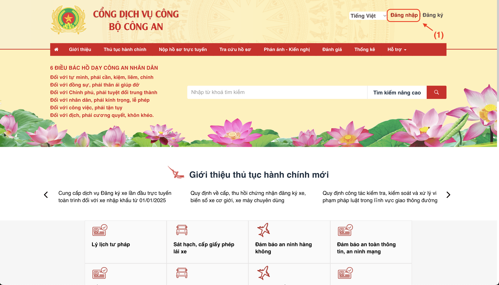
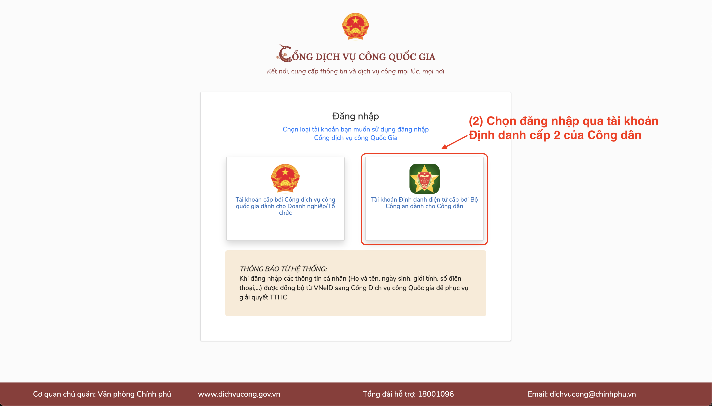
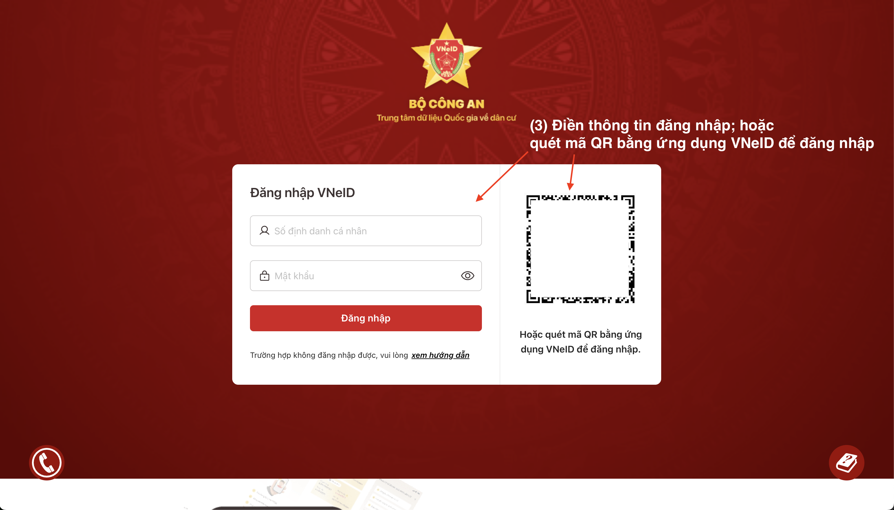
### Bước 2: Tìm thủ tục “Cấp thị thực cho người nước ngoài tại Việt Nam (thực hiện tại cấp tỉnh)”.
(4) - Chọn biểu tượng Home để trở về Trang chủ.
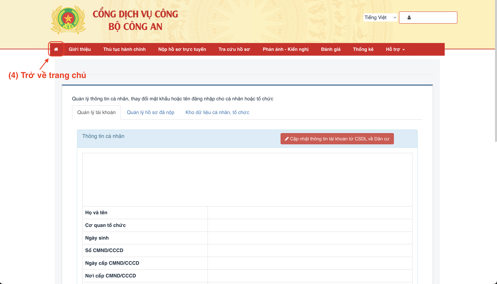

(5) - Tại thanh tìm kiếm của trang web, bạn nhập từ khóa **“Cấp thị thực cho người nước ngoài tại Việt Nam (thực hiện tại cấp tỉnh)”**, sau đó nhấn Enter hoặc chọn biểu tượng kính lúp để bắt đầu tìm kiếm.
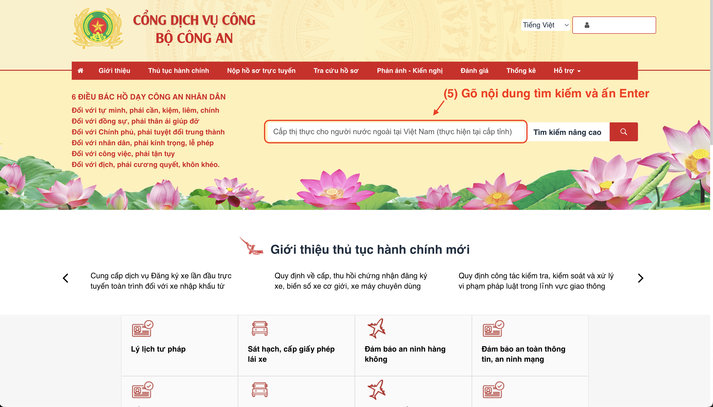

(6) - Hãy nhấp vào kết quả hiển thị thông tin chính xác nhất. Như vậy, bạn đã truy cập vào trang web cung cấp nội dung về thủ tục cấp thị thực cho người nước ngoài tại Việt Nam, do cơ quan cấp tỉnh thực hiện.
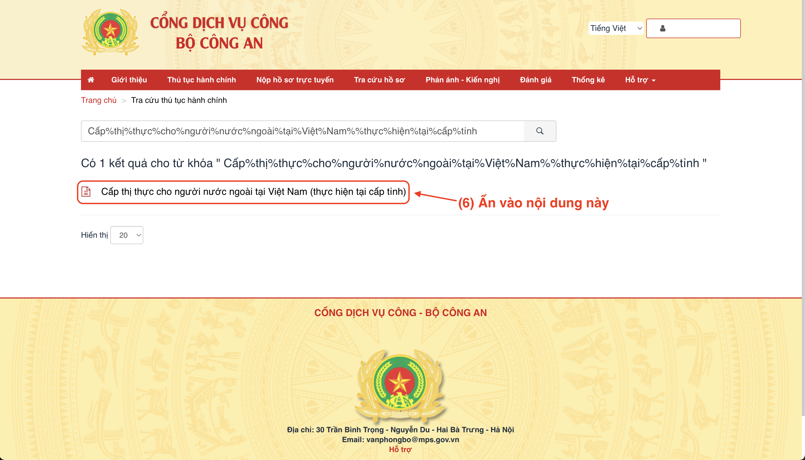
### Bước 3: Thực hiện nộp hồ sơ online.
(7) - Nhấn chọn "Nộp hồ sơ" để bắt đầu quy trình.
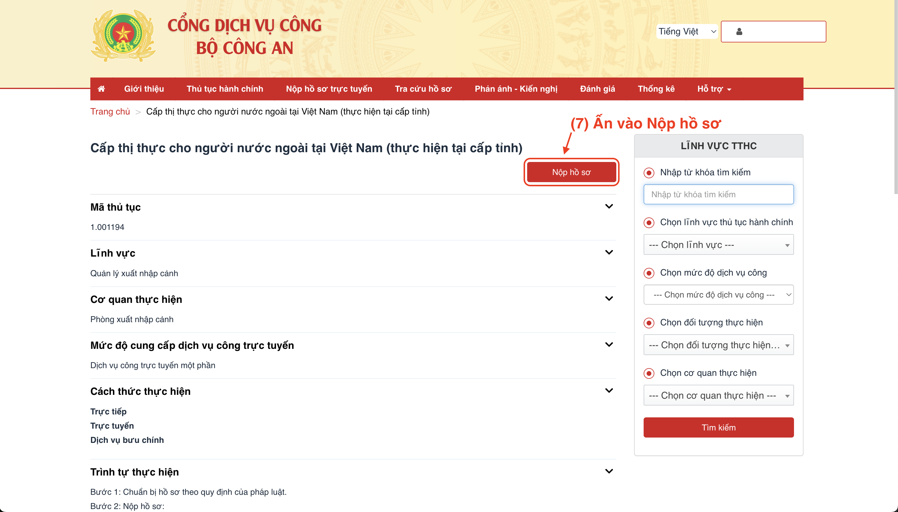

(8) - Chọn **Cơ quan giải quyết hồ sơ** là Phòng Quản lý Xuất nhập cảnh Công an tỉnh nơi người bảo lãnh tạm trú (từ 12 tháng trở lên) hoặc thường trú.

(9) - Chọn "Đồng ý và tiếp tục".
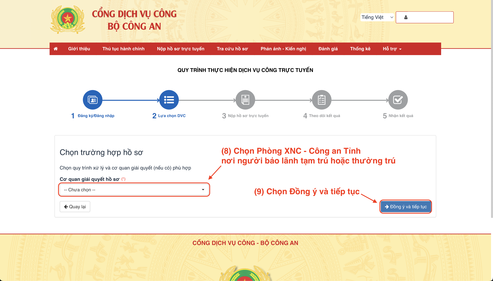

(10) – Nhập thông tin **Người đề nghị**.
- **Ảnh chân dung và ảnh trang nhân thân hộ chiếu**: Vui lòng tải ảnh theo đúng định dạng định dạng .jpg hoặc .jpeg, dung lượng dưới 2MB. Làm theo hướng dẫn được in bằng chữ đỏ trên hệ thống.
- Sau khi tải thành công ảnh trang nhân thân hộ chiếu, các thông tin **Họ và tên** và **Ngày tháng năm sinh** sẽ được hệ thống tự động điền.
- Tiếp tục điền đầy đủ các trường thông tin còn lại. Không bỏ trống bất kỳ mục nào, kể cả các mục không có dấu (*) yêu cầu bắt buộc.
- Lưu ý: Tại mục **Nhập cảnh vào Việt Nam ngày**, hãy điền theo dấu nhập cảnh gần nhất trong hộ chiếu.

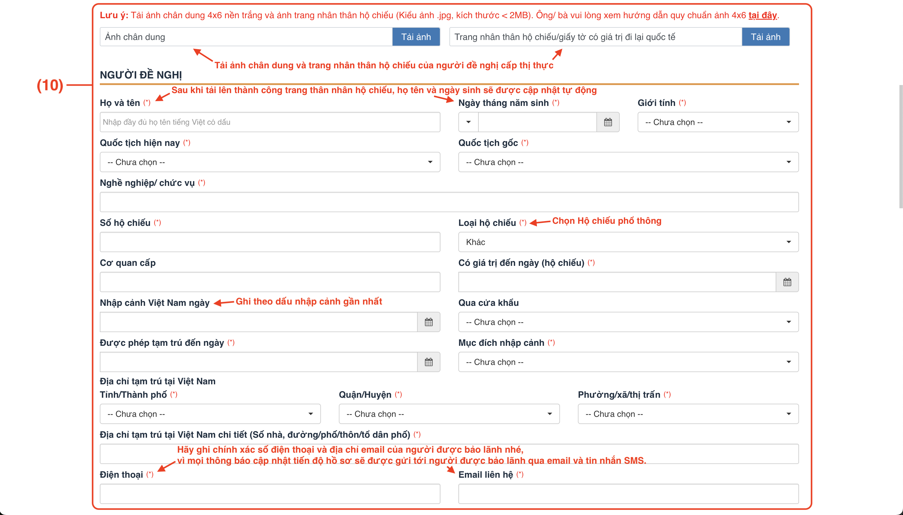

(11) – Nhập thông tin về **Cơ quan/Tổ chức hoặc thân nhân ở Việt Nam mời bảo lãnh**.
- Bởi vì tụi mình xin visa theo diện thăm thân và nộp hồ sơ online qua tài khoản Dịch vụ công cá nhân nên sẽ được mặc định là **Thân nhân**.
- Các nội dung trong các ô màu xám đã được điền tự động từ thông tin tài khoản Dịch vụ công.
- Bạn hãy điền thông tin vào các trường còn lại nhé. Hãy điền đầy đủ thông tin, kể cả các ô không có dấu (*).

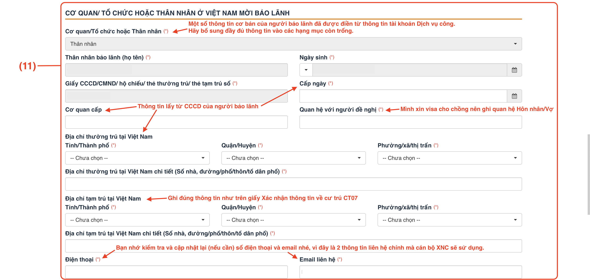

(12) – Nhập **Nội dung đề nghị** và **Nơi tiếp nhận hồ sơ đăng ký**.
- **Cấp thị thực**: Mình chọn loại **nhiều lần** vì thị thực nhiều lần cho phép chồng mình có thể nhập cảnh vào Việt Nam nhiều lần trong suốt thời gian thị thực còn hiệu lực. Ngược lại, thị thực một lần sẽ bất tiện hơn vì chỉ cho phép người được cấp visa nhập cảnh vào Việt Nam duy nhất một lần trong thời hạn thị thực, và nếu người được cấp rời khỏi lãnh thổ Việt Nam trước ngày hết hạn thị thực này thì khi muốn quay lại Việt Nam sẽ cần phải xin một thị thực mới.
- **Có giá trị đến ngày**: Nhập ngày mà bạn mong muốn thị thực có hiệu lực đến thời điểm đó. Lưu ý: thời hạn thị thực diện thăm thân thông thường **không quá 12 tháng**.
- **Lý do**: Điền rõ mục đích xin thị thực. Trong trường hợp của tụi mình là “**Thăm thân**”. Nếu lý do của bạn đặc biệt hơn và cần giải thích cụ thể, bạn có thể trình bày chi tiết tại mục **Những điều cần trình bày thêm**.
- **Nơi nhận thị thực**: Lựa chọn nơi bạn (hoặc người được bảo lãnh) muốn nhận kết quả:
  - Nhận trực tiếp: Chọn nếu bạn muốn đến nhận kết quả tại Phòng Quản lý Xuất nhập cảnh Công an tỉnh nơi đã nộp hồ sơ.
  - Nhận qua bưu chính: Phù hợp nếu bạn ở xa. Kết quả sẽ được gửi qua đường bưu điện hành chính công, chi phí vận chuyển do người nhận thanh toán.

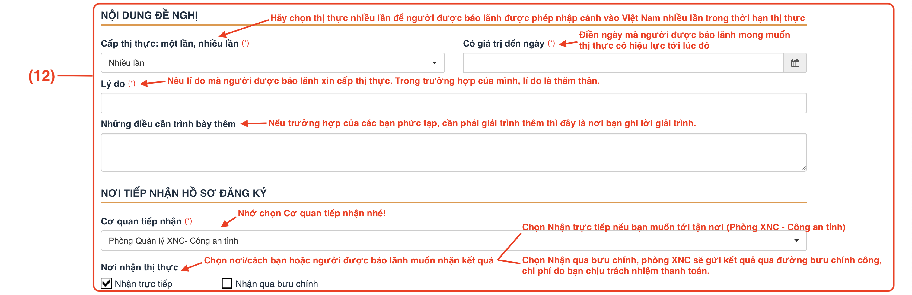

(13) - Tải lên các tệp scan giấy tờ tại mục **Thành phần hồ sơ** (Bước cuối cùng rồi, cố lên các bạn ơi!)
- **Tờ khai đề nghị cấp thị thực, gia hạn tạm trú**: Tải lên file scan của tờ khai NA5 đã được in ra, điền đầy đủ thông tin và ký tên.
- **Giấy tờ chứng minh lý do được gia hạn tạm trú để tiếp tục ở lại Việt Nam – nếu có**: Tải lên một file duy nhất bao gồm các tài liệu sau:
  - Thẻ tạm trú sắp hết hạn (2 mặt);
  - Thông tin đăng ký tạm trú của người nước ngoài;
  - Trang hộ chiếu chứa dấu nhập cảnh gần nhất của người nước ngoài;
  - Giấy tờ tuỳ thân của người bảo lãnh (CCCD 2 mặt);
  - Xác nhận thông tin về cư trú của người bảo lãnh (Mẫu CT07).
- **Giấy tờ chứng minh lý do được cấp thị thực, thẻ tạm trú**: Các giấy tờ chứng minh lý do như giấy phép lao động, chứng nhận đầu tư, v.v… Với bọn mình thì bọn mình tải lên **Giấy đăng ký kết hôn**.
- Sau khi hoàn tất, nhấn "Đồng ý và tiếp tục". Hệ thống sẽ chuyển bạn tới trang xác nhận toàn bộ thông tin và tài liệu đã cung cấp. Nếu phát hiện thông tin chưa chính xác, bạn có thể nhấn "Quay lại" để chỉnh sửa. Nếu mọi thứ đã chính xác và đầy đủ, nhấn "Nộp hồ sơ" để hoàn tất quy trình.

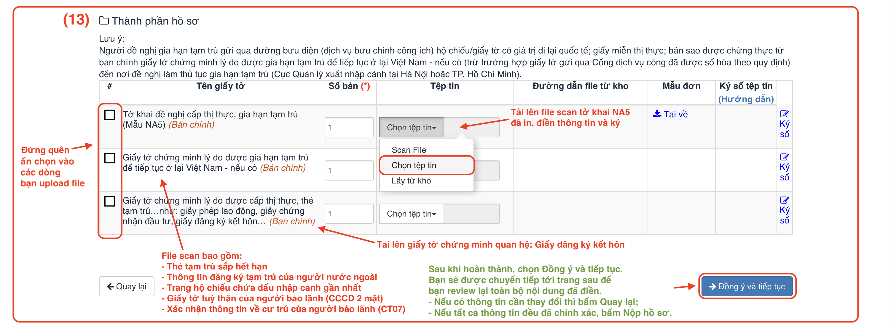

<Spacer size="2"/>

**Chúc mừng! Bạn đã hoàn thành nộp hồ sơ online!** 🎉🎉🎉
- Sau khi nộp hồ sơ xin cấp thị thực online thành công, hệ thống sẽ cung cấp **mã số hồ sơ** – đây là thông tin quan trong để bạn theo dõi tiến trình xử lý hồ sơ.
- Ở phần Thông tin người nộp, bạn sẽ thấy hiển thị họ tên và số điện thoại của người đề nghị xin thị thực. Ngay bên dưới là các mốc thời gian cập nhật trạng thái hồ sơ, giúp bạn nắm rõ quá trình xét duyệt.
- Sau khi hoàn tất việc nộp hồ sơ online, cán bộ Xuất nhập cảnh sẽ tiến hành kiểm tra và phản hồi trong vòng 03 ngày làm việc kể từ ngày tiếp nhận hồ sơ. Trong trường hợp của mình, thời gian phản hồi diễn ra rất nhanh – chỉ sau 1 ngày, mình đã nhận được thông báo yêu cầu bổ sung hồ sơ qua cả email và tin nhắn SMS.

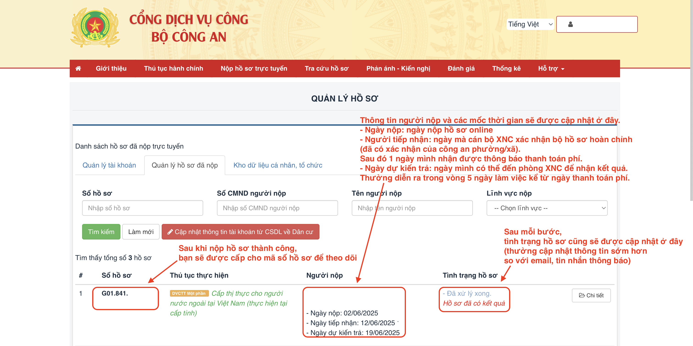
## V. Một Số Lưu Ý Quan Trọng
1. Người bảo lãnh **bắt buộc phải có tài khoản định danh mức 2** để nộp hồ sơ online.
2. Nên bắt đầu **nộp hồ sơ trước ít nhất 15 - 20 ngày** so với ngày hết hạn thẻ tạm trú cũ. Vì đây là thủ tục xin visa thăm thân với người bảo lãnh là cá nhân thân nhân, nên Phòng Quản lý Xuất nhập cảnh Công an tỉnh sẽ tiến hành gửi thông tin xác minh đến Công an xã/phường nơi người bảo lãnh (tức là mình) đang tạm trú hoặc thường trú. Thời gian xác minh thường mất khoảng 3 - 4 ngày làm việc. Nếu hồ sơ được doanh nghiệp đứng ra bảo lãnh, thì không cần bước xác minh tại Công an phường/xã, quy trình xét duyệt sẽ nhanh hơn.
3. Nếu nộp hồ sơ tại nơi **thường trú**, bạn có thể làm hồ sơ **tiếp tục xin thẻ tạm trú dài hạn (tối đa 2 năm)** sau khi có visa TT.
4. Các giấy tờ nước ngoài cần **hợp pháp hóa lãnh sự, dịch công chứng** trước khi sử dụng.
5. Trong quá trình xét duyệt, luôn kiểm tra email và tin nhắn thường xuyên để kịp thời bổ sung nếu có yêu cầu từ Cơ quan Xuất Nhập Cảnh.
6. Nếu bạn nộp hồ sơ bản cứng qua đường bưu điện, hãy nhớ chọn gửi theo dịch vụ **Hành chính công** của Vietnam Post hoặc EMS nhé.
## Kết Luận
Việc xin **visa thăm thân TT cho người nước ngoài đang sinh sống tại Việt Nam** không quá phức tạp, nhưng đòi hỏi bạn phải chuẩn bị hồ sơ đầy đủ, chính xác và nắm rõ quy trình. Qua kinh nghiệm thực tế của gia đình mình, mình hi vọng bài viết này có thể giúp bạn **tiết kiệm thời gian, tránh sai sót** và tự tin hơn khi làm thủ tục.

Nếu bạn có thắc mắc cụ thể nào hoặc gặp khó khăn trong quá trình nộp hồ sơ, đừng ngại để lại bình luận bên dưới hoặc nhắn tin riêng cho mình nhé. Mình sẵn sàng hỗ trợ trong khả năng của mình

**Chúc bạn và gia đình luôn mạnh khỏe, và hồ sơ visa thăm thân được duyệt nhanh chóng!** ❤️
