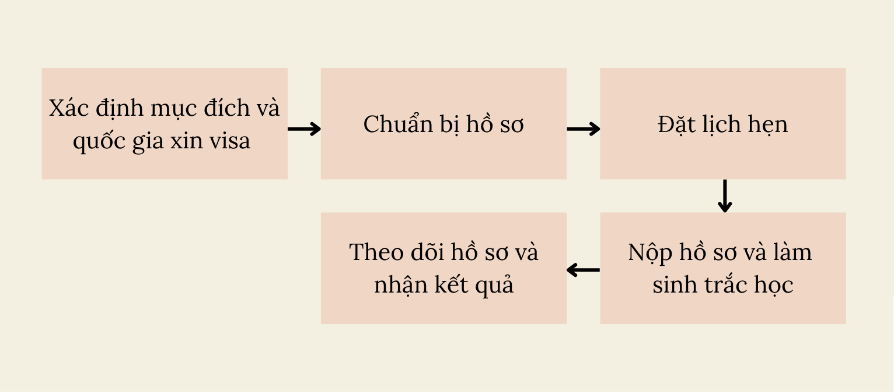
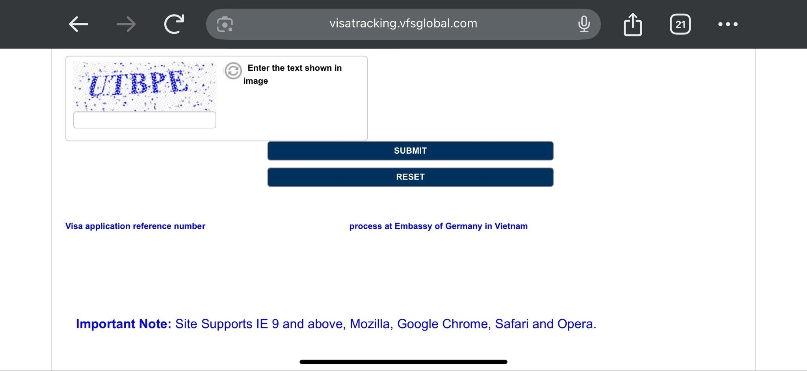

**Xin chào, mình là Hương!** Gia đình mình là vợ Việt chồng Đức. Hiện nay bọn mình đang sinh sống tại Việt Nam.

Mình đã tự thực hiện xin visa Schengen thăm thân tại Đức 2 lần đều thành công, lần 1 vào năm 2023 thăm gia đình bạn trai tức là chồng mình bây giờ, và lần 2 là năm 2025 sau khi bọn mình đã đăng ký kết hôn. Mình thấy có nhiều bạn thắc mắc rằng hiện tại họ đang làm nội trợ ở nhà thì có xin visa Schengen thăm thân được không? Trong trường hợp này thì chứng minh tài chính như nào?

Câu trả lời là Có. Bạn vẫn có thể xin visa Schengen diện thăm thân khi là nội trợ tại gia. Mời các bạn đọc tiếp các nội dung bên dưới để tham khảo thông tin chi tiết về quá trình xin visa cũng như phương thức chứng minh tài chính để có một quá trình xin visa nhẹ nhàng, đơn giản.

## Phần I. Visa Schengen Thăm Thân Là Gì?

Visa Schengen có nhiều diện khác nhau, bao gồm: Du lịch, thăm thân, đoàn thăm chính thức của chính phủ, công tác, khám chữa bệnh, đào tạo ngắn hạn, sự kiện thể thao và văn hoá. Mỗi loại sẽ có những yêu cầu và chi phí khác nhau. Trước khi bắt tay vào chuẩn bị hồ sơ, mình nghĩ việc hiểu rõ mục đích của chuyến đi là điều rất quan trọng để bạn quyết định chọn loại visa phù hợp.

### 1. Visa thăm thân là gì?

a. Visa Schengen diện thăm thân là loại visa ngắn hạn (thời gian ở lại tối đa 90 ngày trong vòng 180 ngày liên tiếp) dành cho những người muốn sang một nước trong khối Schengen để thăm người thân đang sống ở đó. Visa thăm thân chia làm 3 loại theo số lần nhập cảnh: 
- Single Entry: Chỉ nhập cảnh 1 lần
- Double Entry: Được nhập cảnh 2 lần trong thời hạn visa
- Multiple Entry: Được ra vào khối Schengen nhiều lần

Ví dụ cụ thể trường hợp của mình: Mình muốn thăm gia đình chồng là người Đức đang sinh sống tại Đức, kết hợp với du lịch ở Đức. Do vậy, mình chọn xin visa Schengen diện thăm thân, loại Single Entry.

b. Các quốc gia trong khối Schengen bao gồm: 
- 25 quốc gia EU: Ba Lan, Slovakia, Slovenia, Cộng hòa Czech, Estonia, Latvia, Hungary, Phần Lan, Đan Mạch, Lithuania, Malta, Thụy Điển, Luxembourg, Pháp, Bồ Đào Nha, Đức, Áo, Hà Lan, Bỉ, Tây Ban Nha, Ý, Hy Lạp, Croatia, Romania, Bulgaria.
- 4 quốc gia không thuộc EU: Iceland, Na Uy, Thụy Sĩ, Liechtenstein.

### 2. Visa thăm thân khác gì với visa du lịch?
Cả hai loại đều là visa ngắn hạn Schengen (loại C) cho phép đi lại trong các nước thuộc khối Schengen. Tuy nhiên, bạn có thể tham khảo sự khác biệt giữa 2 loại visa này ở bảng dưới đây:

| Điểm khác biệt | Visa thăm thân | Visa du lịch |
| --- | --- | --- |
| Người mời | Cần có thư mời từ người thân là người Đức (không nhất thiết đang sinh sống tại Đức), hoặc người thân (không phải người Đức) đang sống tại Đức | Không bắt buộc |
| Mục đích | Thăm người thân, bạn bè (bao gồm: bạn trai/bạn gái) | Tham quan, du lịch |
| Giấy tờ chứng minh tài chính | Được người thân (người mời) bảo lãnh tài chính và/hoặc tự chứng minh tài chính bản thân | Tự chứng minh toàn bộ |

Vì vậy, nếu **mục đích chuyến đi là để thăm bố mẹ, con cái, anh chị em ruột, vợ/chồng, hoặc họ hàng gần đang sống tại Đức** thì nên xin đúng diện thăm thân - dễ được xét duyệt hơn vì lý do chính đáng, giấy tờ cụ thể hơn.

### 3. Ai có thể xin visa Schengen thăm thân?

Bạn có thể xin visa Schengen diện thăm thân nếu:

a. Có người thân đang cư trú hợp pháp tại Đức (người này có thể là công dân Đức hoặc người nước ngoài có thẻ cư trú dài hạn).

b. Người thân sẵn sàng cung cấp thư mời và giấy cam kết bảo lãnh hoặc giấy tờ chứng minh tài chính nếu bạn cần hỗ trợ tài chính.

c. Bạn có lý do thăm thân rõ ràng và có ràng buộc chắc chắn ở Việt Nam để đảm bảo là bạn sẽ quay về sau chuyến đi.

### 4. Visa Schengen có thời hạn bao lâu?

a. Visa Schengen thường được cấp với **thời hạn lưu trú tối đa là 90 ngày trong vòng 180 ngày**. Tuy nhiên, không phải ai cũng được cấp visa 90 ngày. Thời hạn này sẽ phụ thược vào từng hồ sơ cụ thể và quyết định của Lãnh Sự Quán.

b. Trong nhiều trường hợp, khi xin visa lần đầu tiên, người xin sẽ được cấp visa nhập cảnh 1 lần (single entry) với thời hạn ngắn thường từ 15 đến 30 ngày. Khi bạn đã có lịch sử du lịch tốt, bạn có thể sẽ được cấp visa nhiều lần nhập cảnh (multiple entry) với thời hạn dài hơn như 3 tháng, 6 tháng, thậm chí là 1 - 3 năm.

> Lưu ý:  
> - Dù visa có thời hạn dài, bạn vẫn phải tuân thủ quy tắc “90/180” tức là tổng số ngày bạn ở trong khối Schengen không được vượt quá 90 ngày trong bất kỳ khoảng thờ gian 180 ngày liên tiếp.  
> - Thời hạn visa không phải là thời gian lưu trú. Ví dụ: Bạn được cấp visa có hiệu lực trong 3 tháng, nhưng thời gian được phép lưu trú chỉ là 20 ngày.

## Phần II. Quy Trình Xin Visa Schengen:

### Bước 1. Xác định mục đích và quốc gia xin visa

Đầu tiên bạn cần xác định rõ mục đích của chuyến đi: du lịch, thăm thân, công tác hay du học. Việc xác định đúng mục đích của chuyến đi sẽ giúp bạn lựa chọn đúng loại visa và chuẩn bị hồ sơ chính xác, tránh bị từ chối do chọn sai mục tiêu.

Sau đó, bạn phải xác định mình sẽ nộp hồ sơ tại Đại sứ quán/Tổng Lãnh sự quán (ĐSQ/TLSQ) hay trung tâm tiếp nhận hồ sơ nào.

> Lưu ý: Nếu bạn du lịch nhiều quốc gia trong khối Schengen thì nên nhớ các quy tắc sau:  
>- Bạn lưu trú lâu nhất ở quốc gia nào thì nộp hồ sơ xin visa tại quốc gia đó. Ví dụ: Lịch trình của bạn sẽ đi Đức (10 ngày), Pháp (5 ngày) và Hà Lan (3 ngày) thì bạn nên nộp hồ sơ xin visa Schengen tại Đức vì thời gian bạn dự định lưu trú tại Đức là dài nhất.  
>- Nếu thời gian ở các quốc gia bằng nhau thì bạn nên nộp hồ sơ xin visa tại quốc gia đầu tiên bạn nhập cảnh.

### Bước 2. Chuẩn bị hồ sơ

a. Đây là bước quan trọng nhất và mất nhiều thời gian nhất. Bạn cần chuẩn bị hồ sơ đầy đủ và cẩn thận theo danh sách được yêu cầu (ở Phần IV trong bài viết này).

b. Tất cả các giấy tờ tiếng Việt cần được dịch thuật công chứng sang tiếng Anh (hoặc ngôn ngữ được yêu cầu).

### Bước 3. Đặt lịch hẹn

a. Hầu hết các nước thuộc khối Schengen đều sử dụng các trung tâm tiếp nhận hồ sơ như VFS Global, TLScontact, BLS International để tiếp nhận hồ sơ xin visa. Bạn cần phải đặt lịch hẹn với các trung tâm này để nộp hồ sơ xin visa Schengen.

b. Bạn cần tạo tài khoản, chọn mục đích visa phù hợp và đặt lịch hẹn theo thời gian mà bạn có thể đi nộp hồ sơ. Sau đi đặt lịch hẹn thành công, hệ thống sẽ gửi email xác nhận thông tin buổi hẹn.
Một số trung tâm tiếp nhận như VFS Global có yêu cầu bạn in email xác nhận thông tin buổi hẹn và mang theo khi bạn đi nộp hồ sơ nên hãy cẩn thận đọc email xác nhận để thực hiện theo nhé.

c. Trang web chính thức của các trung tâm tiếp nhận hồ sơ:
- VFS Global: https://www.vfsglobal.com/en/individuals/index.html
- TLScontact: https://www.tlscontact.com/
- BLS International: https://www.blsinternational.com/

### Bước 4. Nộp hồ sơ và làm sinh trắc học

a. Nộp hồ sơ: Theo lịch hẹn, bạn cần đến đúng ngày và thời gian đã đặt lịch tại trung tâm tiếp nhận hồ sơ. Tại đây, bạn sẽ được hướng dẫn nộp hồ sơ xin visa.

b. Làm sinh trắc học: Sau khi đã hoàn thành thủ tục nộp hồ sơ, bạn sẽ tiến hành lấy dữ liệu sinh trắc học, bao gồm: lấy dấu vân tay và chụp ảnh tại chỗ. Bước này là bắt buộc, trừ khi bạn đã từng làm trong vòng 59 tháng (khoảng gần 5 năm) gần nhất.

> Lưu ý: Nếu bạn có ngón tay đang bị thương ở đầu ngón tay, khu vực vân tay và muốn nộp hồ sơ xin visa lần đầu tiên, mình khuyên bạn nên đợi tới khi vết thương lành hẳn rồi đặt lịch hẹn, nếu không, khi ở bước kiểm tra thông tin lịch hẹn và xác nhận thông tin cá nhân, nhân viên sẽ yêu cầu bạn rời sang ngày khác vì không đủ điều kiện lấy dữ liệu sinh trắc học vân tay.

### Bước 5. Theo dõi hồ sơ và nhận kết quả
a. Theo dõi hồ sơ: 

Sau khi nộp xong hồ sơ, bạn sẽ được cấp một mã số để theo dõi tiến độ xử lý. Thời gian xét duyệt thông thường từ 15 – 21 ngày làm việc. Tuy nhiên, vào mùa cao điểm, quá trình này có thể bị kéo dài lâu hơn lên tới 30 – 60 ngày làm việc.

b. Nhận kết quả visa:
Khi có kết quả, bạn sẽ nhận thông báo qua email (nếu bạn có đăng ký thêm dịch vụ ngoài như nhận cuộc gọi, tin nhắn SMS thì kết quả cũng sẽ được gửi về qua các hình thức này). 
- Hãy mang theo CCCD/Căn cước/Giấy tờ tuỳ thân, và 
- Nếu được cấp visa, hãy kiểm tra kỹ các thông tin trên visa để đảm bảo không có sai lệch.
- Nếu bị từ chối, bạn có quyền khiếu nại hoặc nộp lại sau khi điều chỉnh.

## Phần III. Nộp Hồ Sơ Xin Visa Schengen Ở Đâu?

Bạn có thể nộp hồ sơ tại Đại sứ quán/Tổng Lãnh sự quán hoặc các đơn vị được uỷ quyền tiếp nhận hồ sơ xin thị thực như VFS Global, TLScontact và BLS, tuỳ theo mỗi quốc gia và diện visa bạn xin. 

> Hãy kiểm tra nơi tiếp nhận hồ sơ trên trang web của đất nước bạn nộp hồ sơ xin visa nhé.

### 1. VFS Global: Tiếp nhận hồ sơ xin visa Schengen cho các quốc gia:
- Tại Hà Nội (địa chỉ: [Tầng 2, Ocean Park Building, số 1 Đào Duy Anh, Phương Mai, Đống Đa](https://maps.app.goo.gl/X1MCC6rNjfb5mPGGA)): Anh, Úc, Áo, Bỉ, Croatia, Đan Mạch, Đức, Hà Lan, Na Uy, New Zealand, Thụy Điển, Phần Lan, Czech, Latvia, Thụy Sĩ, Ukraine, Ý.
- Tại TP. HCM (địa chỉ: [Tầng 3 và 5, Resco Building, 96 Nguyễn Du, Bến Nghé, Quận 1](https://maps.app.goo.gl/d83VBRBtfEoRo7UU8)): Anh, Úc, Áo, Bỉ, Croatia, Đan Mạch, Đức, Hà Lan, Na Uy, New Zealand, Thụy Điển, Phần Lan, Czech, Latvia, Thụy Sĩ, Ukraine, Ý.
- Tại TP. Đà Nẵng (địa chỉ: [Tầng 6, ACB Building, 218 Bạch Đằng, Hải Châu](https://maps.app.goo.gl/7L1XuczJckwwTpsH9)): Chủ yếu dành cho Anh, Úc, Bỉ, Ý và Czech.

### 2. TLScontact: Tiếp nhận hồ sơ xin visa Schengen cho các quốc gia:
- Tại Hà Nội (địa chỉ: [Tầng 8, Pacific Place, 83B Lý Thường Kiệt, Cửa Nam, Hoàn Kiếm](https://maps.app.goo.gl/oeyHNfSTT2KwwAY36)): Pháp và một số nước châu Âu uỷ quyền như Malta, Estonia, Thuỵ Sĩ, Hungary. Tiếp nhận hồ sơ từ khách hàng trên toàn quốc.
- Tại TP. HCM (địa chỉ: [L08 tầng 12A, Vincom Đồng Khởi, số 72 Lê Thánh Tôn, Bến Nghé, Quận 1](https://maps.app.goo.gl/vzuSceGXWXTcoFJn9)): Pháp, Malta, Estonia, Thuỵ Sỹ, Hungary. Tiếp nhận hồ sơ từ khách hàng tại các tỉnh từ Thừa Thiên Huế trở vào Nam.

### 3. BLS International: Tiếp nhận hồ sơ xin visa Schengen cho quốc gia Tây Ban Nha:
- Tại Hà Nội (địa chỉ: [Tầng 13, Hoa Binh Office Tower, số 106 Hoàng Quốc Việt, Trung Hoà, Cầu Giấy](https://maps.app.goo.gl/pdDUZU5g6iXG63m87)).
- Tại TP. HCM (địa chỉ: [ABO building, số 25 Nguyễn Văn Nguyễn, Tân Định, Quận 1](https://maps.app.goo.gl/dLXY5VJxKrihdy2u6)).

> Tuỳ theo nơi bạn đang sinh sống mà chọn nơi nộp hồ sơ phù hợp.   Tất cả hồ sơ cần đặt lịch hẹn trước trên trang web của Đại sứ quán/TLSQ Đức hoặc nộp qua VFS Global nếu có uỷ quyền.

## Phần IV. Hồ Sơ Xin Visa Schengen Thăm Thân Đức Yêu Cầu Những Gì?

Việc chuẩn bị hồ sơ đầy đủ và chính xác là vô cùng quan trọng. Dưới đây là danh sách các giấy tờ được yêu cầu đối với hồ sơ xin visa Schengen thăm thân Đức cho người Việt Nam. STT giấy tờ trong danh sách dưới đây trùng với số thứ tự trong Danh sách giấy tờ chính thức cần cho hồ sơ xin cấp thị thực thăm thân của Đức, trong đó có một số giấy tờ không cần thiết cung cấp nên bạn có thể thấy một vài trường hợp số thứ tự sẽ bị nhảy (ví dụ STT 3 rồi tới STT 5, bỏ qua STT 4 vì giấy tờ mục STT 4 không cần thiết đối với người Việt Nam).

| STT | Tên giấy tờ, hồ sơ | Yêu cầu |
| :-: | --- | --- |
| 1 | Đơn xin cấp thị thực | - [Mẫu Đơn xin cấp thị thực](https://videx.diplo.de/videx/visum-erfassung/videx-kurzfristiger-aufenthalt).   - Điền đầy đủ bằng tiếng Anh/Đức, không tẩy xoá. In 1 bản, ký tên và ghi rõ ngày tháng. |
| 2 | 2 ảnh hộ chiếu sinh trắc học chụp ảnh gần đây | - Kích cỡ 45 x 35 mm, nền trắng, chụp trong vòng 6 tháng gần nhất. Yêu cầu cụ thể về ảnh hộ chiếu đúng chuẩn [ở đây](https://vietnam.diplo.de/blob/1232638/8b25f160e56c0465aa9b5d5d19f89c4f/170825-fotomustertafel-d-data.pdf).   - 1 ảnh dán trên Đơn xin cấp thị thực, 1 ảnh còn lại không cần dán. |
| 3 | Hộ chiếu/Giấy tờ đi lại chính thức | - Không dùng bao bọc/vỏ bao hộ chiếu.   - Phải còn giá trị ít nhất 3 tháng kể từ ngày bạn rời khỏi khu vực Schengen.   - Có ít nhất 2 trang trống liên tiếp để dán visa.   - Nộp hộ chiếu gốc và 1 bản sao trang thông tin cá nhân và các trang có dấu visa cũ (nếu có). |
| 5 | Bằng chứng về những thị thực Schengen trước đây (nếu có) | In 1 bản màu mỗi thị thực. |
| 6 | Giấy tờ của người mời tại Đức   a. Thư mời.   b. Xác minh tình trạng pháp lý và quyền cư trú của người mời ở châu Âu:   - Nếu người mời là công dân EU: Bản sao thẻ căn cước.   - Nếu người mời là người nước ngoài: bản sao giấy phép cư trú.   c. Chứng minh tài chính của người mời (ý bổ sung):   - Sao kê tài khoản ngân hàng 6 tháng gần nhất.   - Sổ tiết kiệm từ 5,000 USD trở lên.   - Hợp đồng lao động, chứng minh thu nhập hàng tháng (payslip) (nếu có).   - Giấy phép đăng ký kinh doanh nếu là chủ doanh nghiệp.   d. Xác nhận thông tin cư trú (nếu người mời đang sinh sống tại Việt Nam) + TRC tại Việt Nam. | a. Thư mời:   - Viết gần đây bằng tiếng Anh/Đức, không cần theo mẫu, in 1 bản và có chữ ký của người mời.   - Nêu rõ mối quan hệ, thời gian, mục đích thăm thân. Cam kết đảm bảo tài chính và nơi ở (nếu có).   b. Xác minh tình trạng pháp lý và quyền cư trú của người mời ở châu Âu: 1 bản sao 2 mặt.   c. Chứng minh tài chính của người mời (ý bổ sung):   Chỉ cần 1 bản sao mỗi loại giấy tờ.   d. Xác nhận thông tin cư trú (nếu người mời đang sinh sống tại Việt Nam):   - Bạn nộp hồ sơ online qua Cổng dịch vụ công - Bộ Công an rồi ra Công an xã nhận bản cứng. Nộp 1 bản dịch thuật công chứng sang tiếng Anh/Đức.   - Hồ sơ online xin Xác nhận thông tin về cư trú nộp tại đây.   - TRC: 1 bản sao. |
| 7 | Bằng chứng về việc làm của người nộp đơn (nếu có):   a. Hợp đồng lao động.   b. Sao kê tài khoản ngân hàng.   c. Xác nhận của bên sử dụng lao động về việc nghỉ phép (có lương/không lương).   d. Sổ bảo hiểm xã hội.   e. Sổ tiết kiệm.   | *Nếu bạn đang đi làm và có hợp đồng lao động thì hãy bổ sung giấy tờ mục này. Nếu bạn làm nội trợ ở nhà thì bỏ qua.*   a. Hợp đồng lao động:   - Nêu rõ chức vụ/vị trí và thời hạn hợp đồng.   - Bản gốc + 1 bản sao dịch thuật, công chứng sang tiếng Anh/Đức.   b. Sao kê ngân hàng: 1 bản sao kê song ngữ Việt - Anh cho 3 tháng gần nhất, có dấu xác nhận từ ngân hàng (cần thể hiện ghi nhận 3 tháng lương gần nhất).   c.  Xác nhận của bên sử dụng lao động về việc nghỉ phép (có lương/không lương):    - Xin giấy xác nhận bản song ngữ Việt-Anh. Nộp bản gốc.   - Nếu chỉ có bản tiếng Việt thì nộp bản gốc tiếng Việt + 1 bản sao dịch thuật công chứng sang tiếng Anh/Đức.   d. Sổ bảo hiểm xã hội: Bản gốc + 1 bản sao dịch thuật công chứng sang tiếng Anh/Đức.   e. Sổ tiết kiệm:   - Số dư tối thiểu là 5.000 USD.   - Xin Giấy xác nhận số dư của ngân hàng nơi bạn có sổ tiết kiệm. Yêu cầu có thể hiện số tiền chuyển đổi tương đương sang USD. |
| 8 | Chỉ dành cho người nộp đơn là chủ doanh nghiệp hoặc người tự hành nghề:   a. Chứng nhận đăng ký kinh doanh.   b. Báo cáo thuế của công ty trong 3 tháng gần nhất. | 1 bản gốc + 1 bản dịch thuật công chứng sang tiếng Anh/Đức mỗi loại giấy tờ. |
| 9 | Nếu người nộp đơn đã nghỉ hưu:   Xác nhận lương hưu 3 tháng gần nhất, thẻ hưu trí. | a. Xác nhận lương hưu 3 tháng gần nhất: Xin sao kê tài khoản ngân hàng có con dấu và chữ ký xác nhận.   b. Thẻ hưu trí: Bản gốc + 1 bản sao dịch thuật công chứng sang tiếng Anh/Đức. |
| 10 | Nếu người nộp đơn là học sinh/sinh viên:   Xác nhận của nhà trường về việc người nộp đơn đang theo học tại đó và thẻ học sinh, sinh viên. | 1 bản gốc + 1 bản dịch thuật công chứng sang tiếng Anh/Đức mỗi loại giấy tờ. |
| 11 | Chứng minh tài chính cho toàn bộ chuyến đi:   a. Sao kê tài khoản ngân hàng.   b. Giấy cam kết bảo lãnh. | a. Sao kê tài khoản ngân hàng:   - Nếu bạn đang có việc làm thì có thể nộp sao kê tài khoản ngân hàng của bản thân.   - Nếu bạn làm nội trợ và được chồng bảo lãnh thì không cần nộp mục này.   b. Giấy cam kết bảo lãnh:   Trong cả 2 trường hợp khi mình xin visa Schengen diện thăm thân do người yêu (và bây giờ là chồng mình) mời thì đều không xin Giấy cam kết bảo lãnh do Sở Ngoại kiều tại Đức cấp do chồng mình làm việc tại Việt Nam. |
| 12 | Chứng minh khả năng tài chính của người nộp đơn:   Sổ tiết kiệm, chứng nhận sở hữu cổ phiếu, quyền sử dụng đất, v.v… | - Nếu bạn có một trong các loại giấy tờ này thì nộp 1 bản sao dịch thuật công chứng sang tiếng Anh/Đức. |
| 13 | Giấy tờ về gia đình của người nộp đơn:   a. Giấy chứng nhận kết hôn + Giấy chứng minh nhân thân/thẻ căn cước của vợ/chồng + Giấy phép cư trú của vợ/chồng nếu đang hiện cư trú tại EU/Schengen.   b. Giấy khai sinh của tất cả các con + giấy chứng minh nhân dân/ thẻ căn cước.   c. Xác nhận thông tin về cư trú do Cơ quan Công an cấp. | a. Giấy chứng nhận kết hôn:   - 1 bản gốc/trích lục kết hôn + 1 bản dịch thuật công chứng sang tiếng Anh/Đức. Hoặc nếu bạn có Giấy chứng nhận kết hôn của Đức bản song ngữ thì nộp 1 bản gốc + 1 bản sao.   - Giấy chứng minh nhân thân/thẻ căn cước của vợ/chồng: 1 bản sao.   - Giấy phép cư trú của vợ/chồng nếu đang hiện cư trú tại EU/Schengen (nếu có): 1 bản sao.   b. Giấy khai sinh của tất cả các con + giấy chứng minh nhân dân/ thẻ căn cước: 1 bản gốc/trích lục + 1 bản dịch thuật công chứng sang tiếng Anh/Đức mỗi loại.   c. Xác nhận thông tin về cư trú do Cơ quan Công an cấp:   - Nộp [hồ sơ online](https://dichvucong.bocongan.gov.vn/bocongan/bothutuc/tthc?matt=26497) rồi ra Công an xã lấy giấy xác nhận CT07 (cho người Việt Nam) và giấy thông tin khách đăng ký tạm trú (cho người nước ngoài). Nộp 1 bản gốc + 1 bản dịch thuật công chứng sang tiếng Anh/Đức. |
| 14 | Bằng chứng về mối quan hệ với người mời | - Nếu là vợ chồng: Giấy đăng ký kết hôn (đã nộp ở mục 13).   - Nếu là người yêu: Ảnh, thư từ, văn bản giải trình, bản in các cuộc trò chuyện qua mạng xã hội, v.v…   - Nếu là người thân: Hộ khẩu, giấy tờ gia đình, ảnh chụp chung, v.v… |
| 15 | Đặt chỗ chuyến bay | 1 bản sao của xác nhận đặt chỗ chuyến bay đi và chuyến bay về. |
| 16 | Bảo hiểm y tế du lịch bắt buộc. | - Mua loại bảo hiểm y tế du lịch có giá trị cho tất cả các nước Schengen và cho toàn bộ thời gian lưu trú dự kiến, bao gồm cả chi phí điều trị khẩn cấp và vận chuyển về nước vì lý do y tế.   - Mức bảo hiểm tối thiểu: 30.000 EUR.   - Tham khảo các gói bảo hiểm y tế du lịch do VFS gợi ý [ở đây](https://pasarpolis.vn/vfs-vietnam?mission=Germany%20%26%20Schengen%20countries&page_source=RoutePage). |
| 17 | Giấy tờ bổ sung:   a. Lịch trình chuyến đi.   b. Danh sách giấy tờ cần cho hồ sơ xin cấp thị thực – Đi thăm thân nhân/bạn bè | a. Lịch trình chuyến đi: Bao gồm các hoạt động, điểm tham quan bạn dự tính thực hiện trong chuyến đi. Càng chi tiết càng tốt.   b. Danh sách giấy tờ:   - Mẫu danh sách [ở đây](https://www.vfsglobal.com/one-pager/germany/vietnam/vietnamese/pdf/Schengen-visit-M%C3%A4rz-2024.pdf).   - Bạn chỉ cần tải về, in ra và mang theo bộ hồ sơ khi đi nộp.   - Chỉ cần điền thông tin Họ tên và Quốc tịch ở trang đầu tiên, còn lại thì để trống tới khi nộp hồ sơ, nhân viên VFS sẽ kiểm tra bộ hồ sơ, đánh dấu các tài liệu họ nhận và hướng dẫn bạn ký. |

## Phần V. Lệ Phí Xin Visa Schengen Diện Thăm Thân của Đức

### 1. Phí Thị Thực:

| Các loại thị thực | Euro | VNĐ |
| --- | :-: | :-: |
| Thị thực Schengen thông thường (từ 12 tuổi trở lên) | 90 | 2.800.000 |
| Thị thực cho trẻ em 6 - 12 tuổi | 45 | 1.400.000 |
| Thị thực cho trẻ em dưới 6 tuổi | 0 | 0|

#### Các trường hợp miễn phí thị thực Schengen:
- Trẻ em dưới 6 tuổi bất kể mang quốc tịch nào.
- Học sinh, sinh viên, sinh viên tốt nghiệp đại học và giáo viên đi kèm những người sang theo mục đích học tập hoặc đào tạo.
- Các tổ chức phi lợi nhuận.
- “Chuyển ngang” giá trị thị thực cũ từ giấy tờ thông hành hết trang trống sang giấy tờ thông hành mới.
- Vợ chồng, bạn đời cùng giới có đăng ký chung sống và trẻ em công dân Đức, bố mẹ của trẻ em công dân Đức và các thành viên gia đình của công dân EU/EEA, cung cấp cho họ sự tự do trong di chuyển.

### 2. Phí Dịch Vụ VFS:

| Tính chất | Loại phí | VNĐ |
| :-: | --- | :-: |
| Bắt buộc | Phí dịch vụ VFS | 865.000 |
| Tự chọn | Dịch vụ phòng chờ cao cấp | 1.281.000 |
| Tự chọn | Dịch vụ nộp hồ sơ ngoài giờ | 1.276.000 |
| Tự chọn | Dịch vụ khai đơn | 441.000 |
| Tự chọn | Dịch vụ chuyển phát nhanh cộng thêm | 307.000 |
| Tự chọn | Dịch vụ chuyển phát siêu tốc | 255.000 |
| Tự chọn | Dịch vụ chuyển phát nhanh | 194.000 |
| Tự chọn | Dịch vụ dịch thuật | 233.000 |
| Tự chọn | Dịch vụ lấy kết quả ngoài giờ | 192.000 |
| Tự chọn | Dịch vụ quầy truy cập Internet | 153.000 |
| Tự chọn | Dịch vụ thông báo qua điện thoại | 101.000 |
| Tự chọn | Dịch vụ chụp ảnh thẻ | 88.000 |
| Tự chọn | Dịch vụ SMS | 88.000 |
| Tự chọn | Dịch vụ In ấn/Photocopy | 4.000 |

Xem chi tiết các Dịch vụ tự chọn [ở đây](https://visa.vfsglobal.com/vnm/vi/deu/premium-services). Thực ra với các dịch vụ trên, mình đã dùng dịch vụ SMS và gọi điện thông báo qua điện thoại và cảm thấy không cần thiết vì ngay khi có kết quả, thông tin đã được gửi tới địa chỉ email của mình và sau đó 1 ngày thì mới nhận được tin nhắn và cuộc gọi. Khi hồ sơ được thực hiện, các cập nhật thông tin cũng được gửi đầy đủ qua email.

## Phần VI. Một Số Chia Sẻ Từ Kinh Nghiệm Cá Nhân

1. Khi điền đơn xin cấp thị thực, bạn nên chọn ngôn ngữ mẹ đẻ hoặc ngôn ngữ mà bạn thành thạo để thực hiện. Như vậy, tất cả các thông tin giải thích trong đơn sẽ được hiển thị bằng ngôn ngữ này.
2. Khi đi nộp hồ sơ tại trung tâm tiếp nhận VFS, bạn nên sắp xếp giấy tờ theo đúng trình tự ở trên. 
3. Khi nộp hồ sơ tại VFS, nhân viên sẽ hỏi bạn có muốn đăng ký các dịch vụ bổ trợ như thông báo qua cuộc gọi, tin nhắn khi có kết quả visa hay không. Bạn nên xem kỹ bảng giá dịch vụ tại đây hoặc hỏi trực tiếp nhân viên trước khi lựa chọn. Lưu ý rằng, nếu bạn đăng ký dịch vụ thông báo qua điện thoại, họ chỉ thông báo rằng hồ sơ visa của bạn đã có kết quả và hộ chiếu đã được chuyển về VFS, chứ không thông báo bạn được cấp hay bị từ chối visa.
4. Bạn có thể theo dõi tình trạng hồ sơ trực tuyến ở trên trang web Visa Tracking của VFS Global. Bạn chỉ cần nhập mã số hồ sơ (lấy từ email cập nhật thông tin) và tên Họ, nhấn “Submit” là tình trạng hồ sơ sẽ được hiển thị ngay bên dưới.

## Phần VII. Kết Luận

Mỗi hồ sơ xin visa là một câu chuyện riêng, nhưng điểm chung là sự chuẩn bị cẩn thận và thành thật luôn mang lại kết quả tốt. Hy vọng những chia sẻ trên sẽ giúp bạn tự tin hơn trong quá trình chuẩn bị hồ sơ và tránh được những rắc rối không đáng có. Chúc bạn sớm nhận được visa và có một chuyến đi thăm thân trọn vẹn, ý nghĩa!
